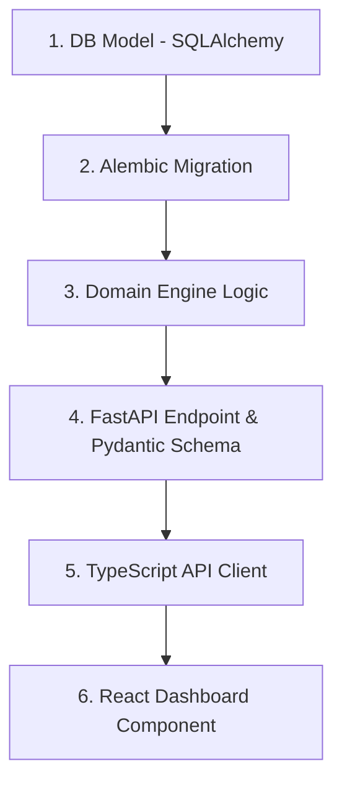

# Footy Full-Stack Feature Scaffolding Guide

This skill ensures clean, unified architecture when adding new football management features across backend and frontend layers.

---

## 1. The 6-Layer Architecture Pipeline



---

## 2. Step-by-Step Implementation Recipe

### Step 1: Database Model (`backend/src/database/models.py`)
* Define SQLAlchemy ORM model with primary keys, foreign keys, and indexes:
  ```python
  class CupCompetition(Base):
      __tablename__ = "cup_competitions"
      id = Column(Integer, primary_key=True)
      name = Column(String(100), nullable=False)
      season_id = Column(Integer, ForeignKey("seasons.id"))
  ```

### Step 2: Alembic Migration (`backend/alembic/`)
* Generate and apply migration:
  ```powershell
  alembic -c backend/alembic.ini revision --autogenerate -m "add_cup_competitions"
  alembic -c backend/alembic.ini upgrade head
  ```

### Step 3: Domain Logic (`backend/src/models/` or `backend/src/logic/`)
* Implement business logic with pure functions and clean state mutations.

### Step 4: FastAPI REST API (`backend/src/api_fastapi.py` & `schemas.py`)
* Define Pydantic response models and register endpoint with error handling:
  ```python
  @app.get("/api/v1/cups/{cup_id}", response_model=CupResponseSchema)
  async def get_cup_details(cup_id: int, db: Session = Depends(get_db)):
      return fetch_cup_data(cup_id, db)
  ```

### Step 5: TypeScript Interface & API Service (`frontend/src/services/api.ts`)
* Add type definition and API request function:
  ```typescript
  export interface CupDetail {
    id: number;
    name: string;
    round: string;
    fixtures: MatchFixture[];
  }

  export const fetchCupDetails = async (cupId: number): Promise<CupDetail> => {
    const res = await axiosInstance.get(`/api/v1/cups/${cupId}`);
    return res.data;
  };
  ```

### Step 6: React UI Page / Component (`frontend/src/pages/` or `components/`)
* Build UI using Tailwind CSS, MUI, and React Query / Zustand.
