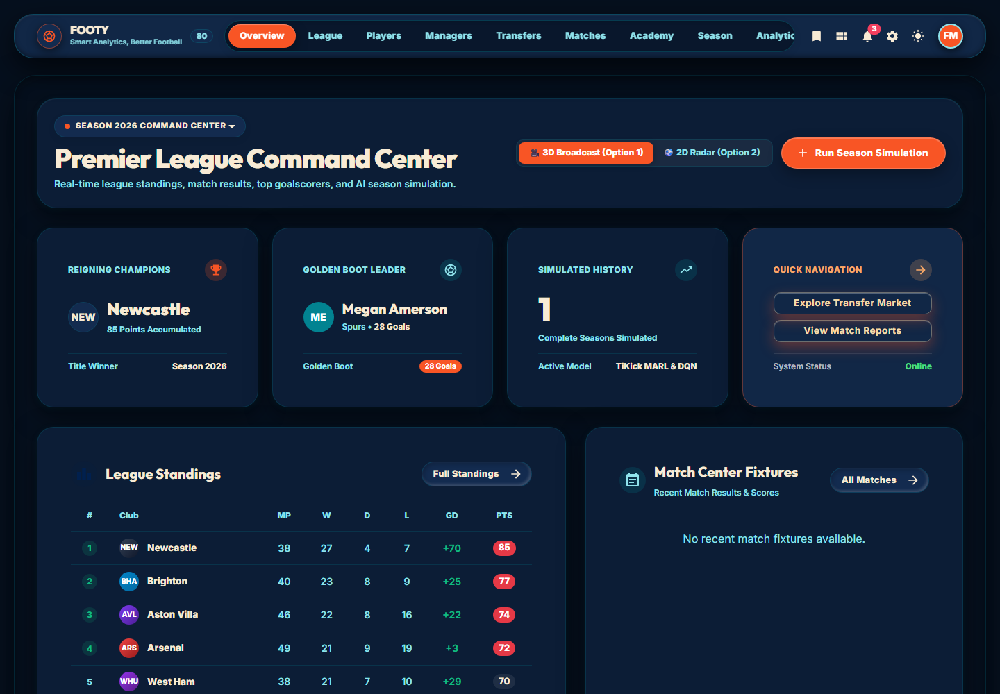
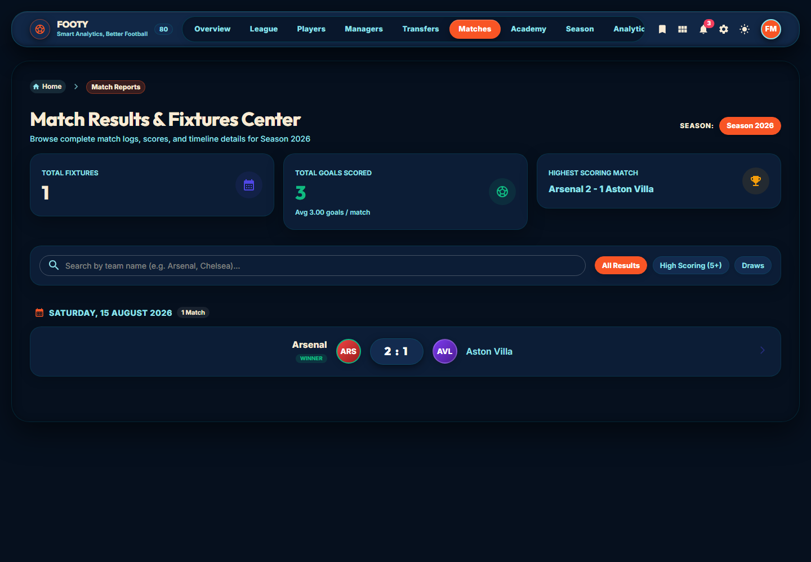
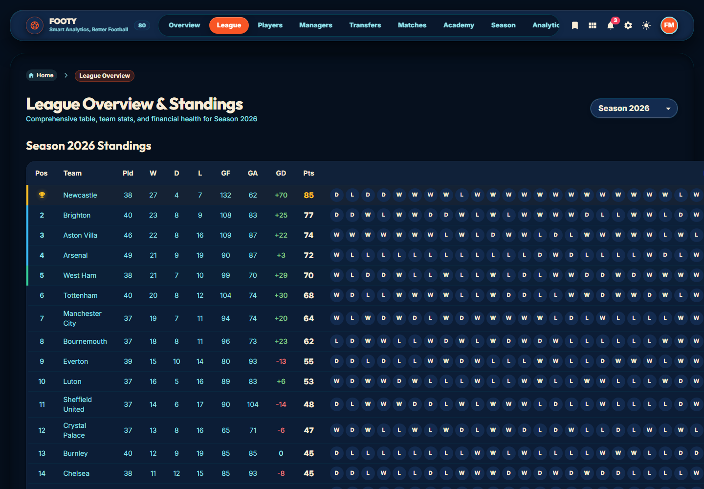
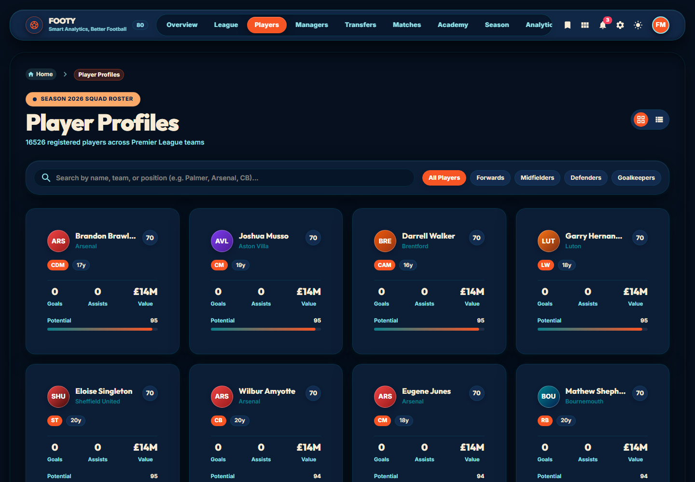
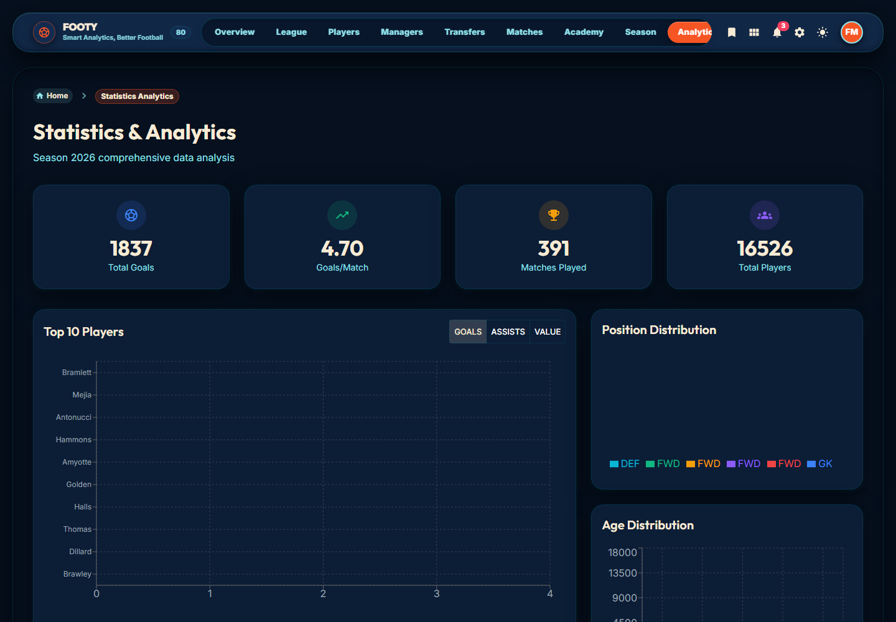
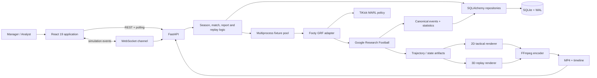
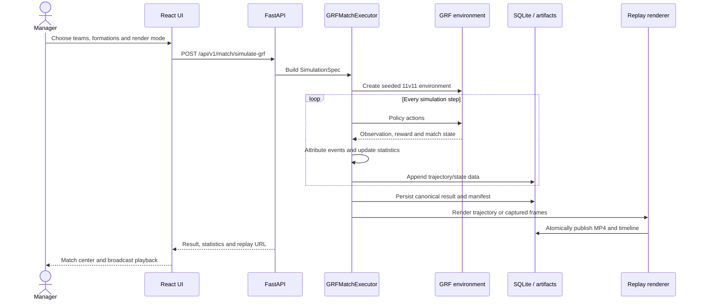
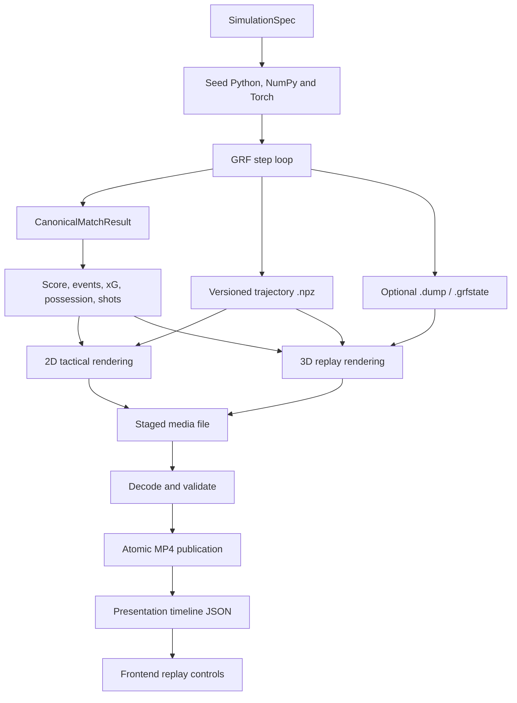
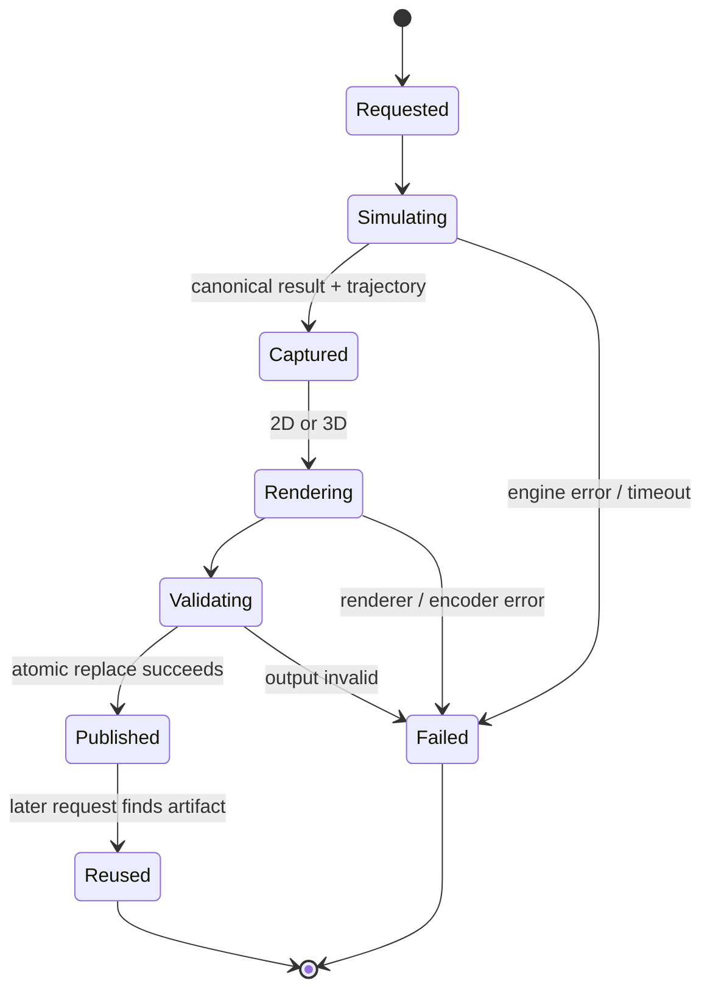

<div align="center">

# ⚽ Footy

### A full-stack football simulation laboratory powered by Google Research Football

Season management, 11v11 multi-agent simulation, tactical analysis, deterministic artifacts, 2D visualization, and broadcast-style 3D replays in one project.

[](https://www.python.org/)
[](https://fastapi.tiangolo.com/)
[](https://react.dev/)
[](https://www.typescriptlang.org/)
[](https://github.com/google-research/football)
[](https://www.sqlite.org/)

[See the UI](#the-platform) · [Watch a match](#a-real-generated-match) · [Architecture](#how-it-works) · [Run locally](#run-it-locally) · [Engineering status](#engineering-status)

</div>



## What Footy does

Footy joins a football-management simulation with a real physics environment and a visual analytics product. A season scheduler creates fixtures, manager policies influence teams, GRF executes 11v11 matches, the backend persists results and artifacts, and the React client turns those outputs into tables, player profiles, charts, tactical views, and replays.

| Area | Capabilities |
| --- | --- |
| Match engine | GRF 11v11 physics, TiKick multi-agent policies, tactical transforms, seeded execution, event and touch attribution |
| Season simulation | Double round-robin scheduling, matchdays, standings, training, recovery, finances, transfers, youth, rollover |
| Replay system | Versioned trajectory NPZ, optional GRF state/dump capture, 2D render, 3D render, FFmpeg encoding, timeline metadata |
| Football data | Goals, shots, xG, possession, passes, fouls, cards, substitutions, lineups, player and team histories |
| Application | FastAPI REST/WebSocket layer, SQLAlchemy repositories, SQLite WAL persistence, React Query and Zustand client state |
| Presentation | Command center, league table, player and manager profiles, match center, analytics, AI benchmarks, broadcast overlays |

## A real generated match

This repository includes a fresh match generated through the real `/api/v1/match/simulate-grf` path on **6 September 2026**. Arsenal beat Chelsea **1–0**, with Arsenal Player 8 scoring at 73′.

<div align="center">


**Arsenal 1–0 Chelsea** · 63%–37% possession · 1–0 shots · 0.30–0.00 xG

[▶ Watch the complete 3D replay](assets/readme/showcase-match.mp4) · [View match JSON](assets/readme/showcase-match.json) · [Inspect presentation timeline](assets/readme/showcase-match.timeline.json)

</div>

| Render property | Verified value |
| --- | ---: |
| Resolution | 1280 × 720 |
| Frame rate | 15 fps |
| Codec | H.264 High Profile |
| Duration | 108.93 seconds |
| Frames decoded | 1,634 |
| File size | 3.60 MiB |

The video includes a lineup presentation, GRF gameplay, score and match-clock overlays, a radar, match events, and a full-time statistics card.


<details>
<summary><strong>Reproduce the showcase request</strong></summary>

```powershell
$body = @{
  match_id        = "readme_showcase_arsenal_chelsea_20260906"
  home_team_name  = "Arsenal"
  away_team_name  = "Chelsea"
  home_formation  = "4-3-3"
  away_formation  = "4-2-3-1"
  max_steps       = 1200
  generate_video  = $true
  record_dump     = $true
  render_mode     = "3d"
} | ConvertTo-Json

Invoke-RestMethod `
  -Method Post `
  -Uri "http://localhost:5001/api/v1/match/simulate-grf" `
  -ContentType "application/json" `
  -Body $body
```

The same request ID can reuse an existing artifact. Use a new `match_id` when you want a new simulation.

</details>

## The platform

### Match center

Browse fixtures by season, search by club, filter results, and open the detailed match timeline and replay experience.



### League command and standings

Season selection, club form, goals for and against, goal difference, points, and financial context are presented in one league view.



### Player database

Search and filter the generated player population by name, team, position, age, value, rating, and potential.



### Analytics

The analytics workspace combines competition-level totals, player rankings, position distributions, age curves, team comparisons, and financial trends.



## How it works

### System architecture



### Match execution sequence



### Simulation-to-replay artifact flow



### Match artifact lifecycle



## Repository at a glance

Counts below were generated from the application and test source on **6 September 2026**. Vendored TiKick code, virtual environments, dependencies, and generated bundles are excluded.

| Metric | Count |
| --- | ---: |
| Python files (`backend/src` + `backend/tests`) | 79 |
| Python lines | 21,681 |
| TypeScript/TSX files (`frontend/src`) | 37 |
| TypeScript/TSX lines | 11,561 |
| FastAPI route decorators, including compatibility aliases | 63 |
| SQLAlchemy table models | 41 |
| Backend test functions | 105 |
| React pages | 14 |
| React components | 16 |
| Alembic revisions | 5 |

### Main repository map

```text
Footy/
├── backend/
│   ├── alembic/                 schema revisions
│   ├── benchmarks/              simulation benchmark harness
│   ├── data/                    SQLite database and saves
│   ├── reports/                 match, season, ML and replay artifacts
│   ├── src/
│   │   ├── api_fastapi.py       HTTP, WebSocket and media routes
│   │   ├── database/            ORM models, sessions and repositories
│   │   ├── logic/               GRF, scheduling, replay and rendering
│   │   ├── ml/                  DQN manager and evaluation code
│   │   └── models/              football domain objects
│   └── tests/                   unit, integration and GRF certification tests
├── frontend/
│   ├── src/components/          replay, formation, tables and charts
│   ├── src/pages/               14 product surfaces
│   ├── src/services/            typed API client
│   └── src/store/               simulation state
├── assets/readme/               screenshots and showcase match
└── docs/                        architecture, setup and audit documentation
```

## Core engineering ideas

### Canonical attacking coordinates

Home and away observations are normalized into the same attacking orientation before tactical policy adjustments. Directional actions are mirrored back once at the environment boundary. This reduces side-specific policy behavior and makes symmetry testable.

### One canonical match result

The executor produces a typed result that owns the score, event stream, statistics, artifact references, and fingerprint. Renderers consume that result rather than trying to rediscover scorers or recalculate the final score from replay frames.

### Run-scoped persistence

Persisted match uniqueness includes the simulation run, season, and match number. Historical runs can remain available while current-run queries select an explicit or latest run.

### Failure-aware media publication

Replay encoders write to staging paths, drain FFmpeg stderr, validate output, and atomically replace the published file. Bounded queues and cancellation paths prevent a failed encoder from silently blocking producers forever.

## Run it locally

### Requirements

- Python 3.12
- Node.js 18+
- FFmpeg
- Windows 11 with WSL2 Ubuntu, or a Linux environment capable of running GRF
- A working GRF installation and TiKick checkpoint for neural 11v11 simulation
- NVIDIA CUDA is optional; benchmark before choosing GPU policy inference or hardware encoding

### Backend

```powershell
python -m venv .venv
.venv\Scripts\Activate.ps1
pip install -r requirements.txt
pip install -r requirements-dev.txt
Copy-Item .env.example .env

python backend/src/dev_server.py
```

The API runs at `http://localhost:5001`; Swagger UI is at `http://localhost:5001/docs` and health is at `http://localhost:5001/api/v1/health`.

### Frontend

```powershell
cd frontend
npm install
Set-Content .env 'VITE_API_BASE_URL=http://localhost:5001'
npm run dev
```

The frontend runs at `http://localhost:5173`.

### Docker application services

```powershell
docker compose up --build
```

Compose serves the frontend on port 80 and the API on port 5001. GRF, WSL, EGL, CUDA, and GPU pass-through remain host-specific concerns.

## Tests and verification

```powershell
$env:PYTHONPATH="backend/src"
pytest backend/tests -v

cd frontend
npm test -- --runInBand
npx tsc --noEmit
npm run build
```

Last reproduced on the configured Windows/WSL host on **6 September 2026**:

| Check | Result |
| --- | --- |
| Full backend suite with available GRF integration | **95 passed, 9 skipped** |
| Targeted regression and API suites | **23 passed** |
| Frontend Jest | **6 passed** |
| TypeScript | Passed |
| Vite production build | Passed; 2,225 modules transformed |
| Existing SQLite database | `integrity_check=ok`; zero foreign-key violations |

## Engineering status

Footy is an ambitious active-development project with working simulation, data, rendering, and product surfaces. The test results above are real, but they do not mean every production boundary is complete.

Known high-priority work includes:

- repairing fresh-database Alembic bootstrap;
- returning durable run/job IDs for season simulation and ML evaluation;
- closing the fixture dequeue/worker-ownership crash window;
- making presentation timelines frame-accurate for every renderer;
- replacing automatic compatibility pickle loading with an explicit trusted import path;
- enforcing resolved containment for recording and model paths;
- replacing the synthetic sequential scaling harness with real process-pool benchmarks.
- choosing and adding a repository license before inviting external reuse or contributions.

The generated showcase also exposed a model-name collision in the on-demand API’s video-link persistence path. The video was published correctly, but linking it back to the database row failed because a domain `Match` class shadowed the ORM `Match` class. This is tracked as a correctness fix rather than hidden from the project status.

See [Current Implementation Status](docs/05_current_status.md) for reproduced evidence and [Backend Audit Remediation Plan](docs/Backend_audit_PLAN.md) for the ordered work plan.

## Documentation

- [System architecture](docs/01_architecture.md)
- [Backend and simulation logic](docs/02_backend_logic.md)
- [Data models and artifact schemas](docs/03_data_models.md)
- [Frontend guide](docs/04_frontend_guide.md)
- [Current implementation status](docs/05_current_status.md)
- [Setup and execution](docs/06_setup_and_run.md)
- [Backend remediation plan](docs/Backend_audit_PLAN.md)

---

Built by [Kevin Paul](https://github.com/x-Kevin-Paul-x).
