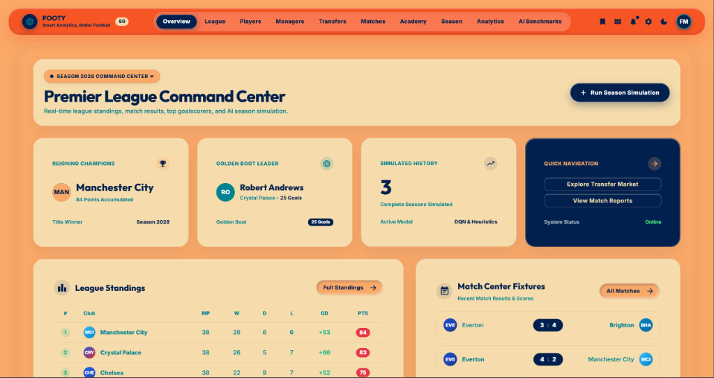
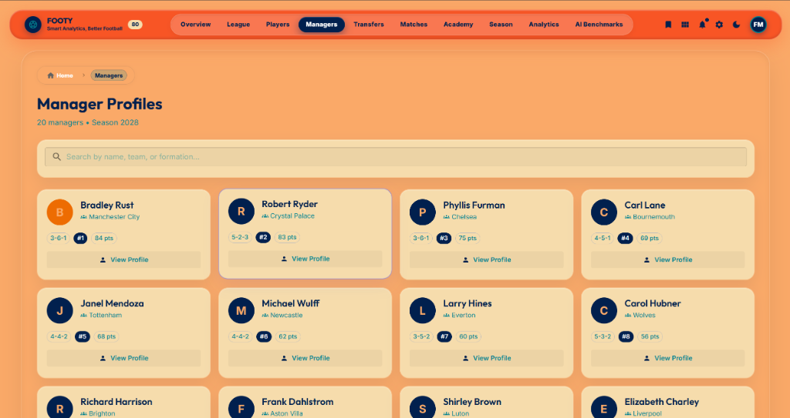
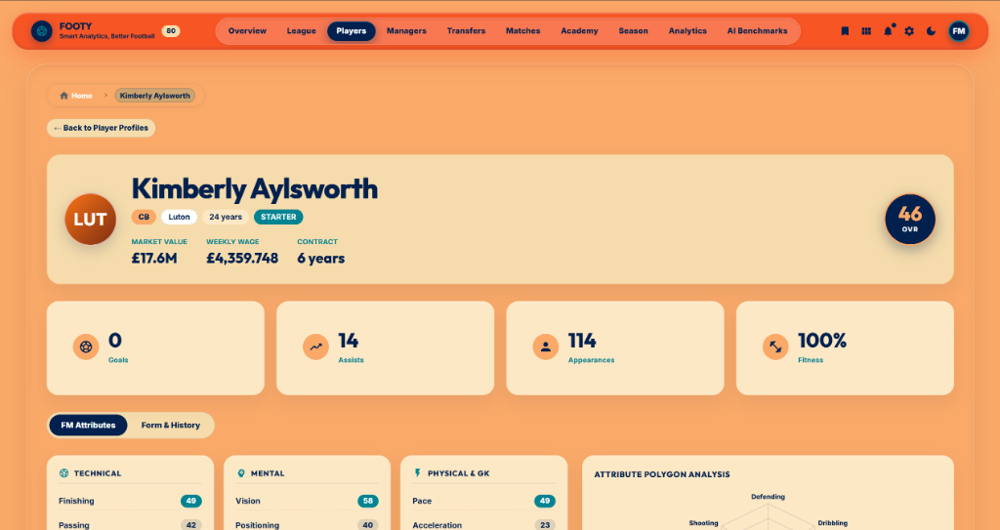
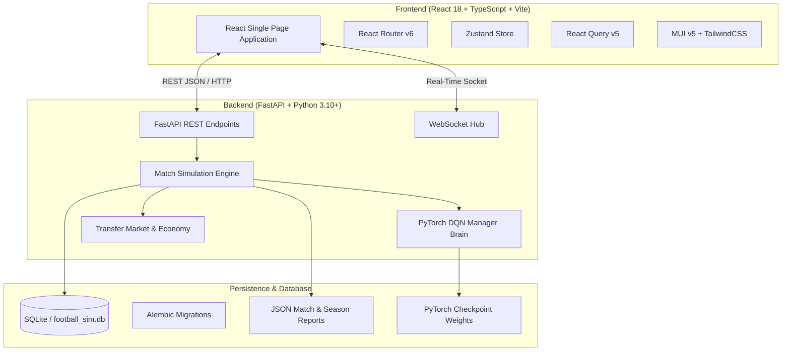

# ⚽ Footy: Intelligent Football Simulation & AI Manager Engine

[](https://www.python.org/)
[](https://fastapi.tiangolo.com/)
[](https://pytorch.org/)
[](https://reactjs.org/)
[](https://www.typescriptlang.org/)
[](https://mui.com/)
[](https://tailwindcss.com/)
[](https://www.sqlite.org/)
[](https://opensource.org/licenses/MIT)

> **Footy** is a full-stack football league simulation and management platform powered by Deep Reinforcement Learning (DQN), advanced expected goals ($xG$) match engines, realistic transfer economics, and a responsive, retro-tactile React dashboard.

---

## 📸 Application Gallery

### 1. Premier League Command Center
Live season standings, instant season simulation controls, multi-season history selector, goalscorer leaderboards, and real-time match outcome summaries.



### 2. Tactical Formations & AI Manager Profiles
Inspect manager tactical setups (4-3-3, 4-2-3-1, 3-5-2), tactical styles (Tiki-Taka, Gegenpressing, Counter-Attack), experience tiers, win rates, and AI brain decision histories.



### 3. Football Manager Style Player Attributes & Pentagon Radar
Deep attribute breakdown (Technical, Mental, Physical, Goalkeeping), radar comparison pentagons, market value valuations, wage demands, and form ratings.



---

## 🌟 Core Features

- 🧠 **Deep Reinforcement Learning (DQN) & Adaptive AI**:
  - Managers train with Deep Q-Networks (`dqn_best.pt`) with action-masking and experience replay.
  - Contextual rewards based on league placement, squad balance, tactical fit, and wage-to-turnover ratio.
  - Benchmarking suite comparing trained DQN policies against `random`, `rule-based`, and baseline heuristics.

- ⚙️ **High-Fidelity Match Engine**:
  - Deterministic and stochastic match simulation driven by individual player attributes, team cohesion, fatigue, home advantage, and tactical mismatches.
  - Expected Goals ($xG$) modeling, shot quality computation, possession metrics, injury occurrences, and referee card events.

- 💼 **Dynamic Transfer Market & Youth Academy**:
  - AI-driven transfer negotiations with market valuations determined by age, potential, remaining contract length, and form.
  - Scouting and youth development pipelines with customizable coaching sessions and specialized training focuses.

- ⚡ **Real-Time Simulation Streaming**:
  - WebSocket support for real-time play-by-play simulation streaming and toast notifications.
  - Instant multi-season simulation batching with persistent SQLite snapshots.

- 🎨 **Modern Tactile UI & Analytics**:
  - Warm retro color palette with floating pill navigations and responsive layout.
  - Season-by-season comparison charts, head-to-head records, squad depth charts, and transfer expenditure breakdowns.

---

## 🏗️ Architecture & Technology Stack



| Layer | Technologies |
| :--- | :--- |
| **Frontend** | React 18, TypeScript, Vite, Material-UI (MUI), Tailwind CSS, Lucide / MUI Icons, Recharts, React Query, Zustand |
| **Backend** | Python 3.10+, FastAPI, Uvicorn, Pydantic v2, WebSockets, NumPy, Pandas |
| **Machine Learning** | PyTorch, Deep Q-Learning (DQN), Q-Tables, Discretized State Encoders, Action-Masking |
| **Database & Storage** | SQLite3, SQLAlchemy ORM, Alembic Migrations, JSON Artifact Store |
| **DevOps & Containers**| Docker, Docker Compose, Multi-stage Dockerfiles, Pytest |

---

## 🚀 Quick Start Guide

### Prerequisites
- **Python**: `3.10` or higher
- **Node.js**: `18.0` or higher (with `npm`)
- **Git**

---

### Option A: Local Development Setup

#### 1. Clone the Repository
```bash
git clone https://github.com/x-Kevin-Paul-x/Footy.git
cd Footy
```

#### 2. Configure Environment Variables
```bash
# Windows PowerShell
Copy-Item .env.example .env
Copy-Item frontend\.env.example frontend\.env

# Linux / macOS
cp .env.example .env
cp frontend/.env.example frontend/.env
```

#### 3. Backend Setup
```bash
# Create and activate virtual environment
python -m venv .venv

# Windows:
.venv\Scripts\Activate.ps1
# Linux / macOS:
# source .venv/bin/activate

# Install dependencies
pip install -r requirements.txt
pip install -r requirements-dev.txt

# Initialize database schema
$env:PYTHONPATH="backend/src"
python backend/src/database/db_setup.py

# Start FastAPI server (Port 5001)
python -m uvicorn backend.src.api_fastapi:app --host 0.0.0.0 --port 5001 --reload
```

#### 4. Frontend Setup
In a new terminal window:
```bash
cd frontend
npm install
npm run dev
```

Visit **[http://localhost:5173](http://localhost:5173)** in your browser! 🎉

---

### Option B: Docker Compose (All-in-One)

You can spin up both the FastAPI backend and the React frontend with a single command:

```bash
docker-compose up --build
```

- **Frontend**: [http://localhost:3000](http://localhost:3000)
- **Backend API**: [http://localhost:5001](http://localhost:5001)
- **Interactive OpenAPI Docs**: [http://localhost:5001/docs](http://localhost:5001/docs)

---

## 🧪 Testing & Verification

Run the comprehensive test suites across backend logic, API endpoints, and frontend components:

### Backend Pytest Suite
```bash
$env:PYTHONPATH="backend/src"
pytest backend/tests/ -v
```

### Frontend TypeScript & Production Build Check
```bash
cd frontend
npm run build
```

---

## 🤖 Reinforcement Learning & Benchmarking

### 1. Evaluate a Trained DQN Model
Evaluate the DQN policy against baseline heuristics (`random`, `do_nothing`, `rule_based`):
```bash
pip install -r requirements-ml.txt
$env:PYTHONPATH="backend/src"
python backend/src/ml/train_rl.py eval --model ml/models/dqn_best.pt --episodes 10 --fast-mode
```

### 2. Compare Multiple Checkpoints
Generate multi-checkpoint comparison artifacts (viewable in the **AI Benchmarks** tab of the UI):
```bash
$env:PYTHONPATH="backend/src"
python backend/src/ml/train_rl.py compare --models ml/models/dqn_best.pt ml/models/dqn_final.pt --episodes 10 --fast-mode
```

---

## 📁 Repository Structure

```text
Footy/
├── backend/
│   ├── alembic/                # Database migrations
│   ├── data/                   # SQLite database & CSV records
│   ├── reports/                # Match, season, and transfer JSON reports
│   ├── src/
│   │   ├── api_fastapi.py      # FastAPI routing & WebSockets
│   │   ├── config.py           # Application settings & environment vars
│   │   ├── main.py             # CLI simulation driver
│   │   ├── schemas.py          # Pydantic request/response models
│   │   ├── database/           # DB tables, sessions, and CRUD operations
│   │   ├── logic/              # Manager brain, state encoders, profiles
│   │   └── models/             # Domain models (Team, Player, Match, etc.)
│   └── tests/                  # Backend unit and integration tests
├── frontend/
│   ├── public/                 # Static assets & textures
│   ├── src/
│   │   ├── components/         # Reusable charts, cards, widgets, tables
│   │   ├── hooks/              # Socket connections & simulation hooks
│   │   ├── pages/              # 10+ Complete analytics & management pages
│   │   ├── services/           # Axios REST API client
│   │   ├── store/              # Zustand global application state
│   │   ├── App.tsx             # Root layout, routes, navigation bar
│   │   └── index.css           # Design tokens & tactile style definitions
│   ├── package.json            # Frontend dependencies
│   └── vite.config.ts          # Vite build configuration
├── docs/                       # Architectural guides & screenshots
├── docker-compose.yml          # Container orchestration
├── pyproject.toml              # Python project metadata
└── README.md                   # Project documentation
```

---

## 📜 License

Distributed under the **MIT License**. See `LICENSE` for more information.

---

## 👨‍💻 Maintainer & Contact

- **Author**: Kevin Paul
- **GitHub**: [@x-Kevin-Paul-x](https://github.com/x-Kevin-Paul-x)
- **Repository**: [https://github.com/x-Kevin-Paul-x/Footy](https://github.com/x-Kevin-Paul-x/Footy)
