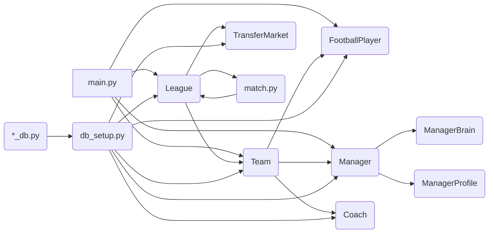

# Footy: A Football League Simulation with Reinforcement Learning

**Tagline:** Combining realistic football management with AI-driven decision-making.

## I. Introduction

Footy is a Python-based simulation of a football (soccer) league. It models various aspects of football management, including team management, player development, match simulation, and a transfer market. The simulation incorporates elements of reinforcement learning for manager decision-making and player training. This project serves as a portfolio piece, showcasing skills in simulation, AI, and software development.


### Application Screenshots

#### Premier League Command Center


#### Manager Profiles & Tactical Formations


#### Football Manager (FM) Style Player Attributes & Pentagon Analysis


## II. Features

*   Realistic team and player attributes.
*   AI-controlled managers using reinforcement learning.
*   Optional DQN training workflow with reproducible ML dependencies.
*   Benchmarkable RL evaluation reports against simple baselines.
*   Checkpoint-to-checkpoint RL comparison reports for model progression analysis.
*   Dynamic transfer market.
*   Detailed match simulation.
*   Season reports and league standings.
*   Database integration for persistent data storage.

## III. Installation

*   **Prerequisites:**
    *   Python 3.x
    *   pip package manager
*   **Dependencies:**
*   Python dependencies are pinned in `requirements.txt`
*   `sqlite3` is included with Python
*   **Installation Instructions:**
    1.  Clone the repository:
        ```bash
        git clone https://github.com/yourusername/Footy.git  # Replace with your actual repository URL
        ```
    2.  Navigate to the project directory:
        ```bash
        cd Footy
        ```
    3.  Install the dependencies:
        ```bash
        pip install -r requirements.txt
        ```
    4.  Set up the database:
        ```bash
        $env:PYTHONPATH="backend/src"; python backend/src/database/db_setup.py
        ```
    5.  Optional runtime configuration:
        ```bash
        copy .env.example .env
        copy frontend\.env.example frontend\.env
        ```
        Backend variables are read from the shell environment when you run Python. Frontend variables are read by Vite from `frontend/.env`.

## IV. Usage

*   To run the simulation, execute the `main.py` script:
    ```bash
    $env:PYTHONPATH="backend/src"; python backend/src/main.py
    ```
    Useful runtime flags:
    *   `FOOTY_NUM_SEASONS` controls how many seasons are generated per simulation run.
    *   `FOOTY_SIMULATION_TIMEOUT_SECONDS` controls the API timeout for simulation runs.
    *   `FOOTY_API_PORT` controls the Flask API port.

*   To run the frontend, use:
    ```bash
    cd frontend; npm run dev
    ```
    Then open [http://localhost:5173/](http://localhost:5173/) in your browser.
*   This script will:
    *   Create a simulated Premier League with 20 teams.
    *   Generate a season schedule.
    *   Simulate the entire season, match by match.
    *   Print the final league standings.
    *   Print the team of the season (best XI players).
    *   Save a detailed season report to `season_reports/season_report_<year>.json`.
    *   Match reports for each match are saved in the `match_reports/` directory.
*   You can customize the simulation by modifying the parameters in `main.py`, such as the number of seasons (`num_seasons`) and team budgets.
*   To run the tests:
    ```bash
    pip install -r requirements-dev.txt
    $env:PYTHONPATH="backend/src"; pytest backend/tests/
    ```

*   To install the optional ML stack and evaluate the DQN manager:
    ```bash
    pip install -r requirements-ml.txt
    $env:PYTHONPATH="backend/src"; python backend/src/ml/train_rl.py eval --model ml/models/dqn_best.pt --episodes 10 --fast-mode
    ```
    This writes a benchmark report to `ml/reports/` and compares the trained policy against baseline policies such as `random` and `do_nothing`.

*   To compare multiple checkpoints directly:
    ```bash
    $env:PYTHONPATH="backend/src"; python backend/src/ml/train_rl.py compare --models ml/models/dqn_best.pt ml/models/dqn_final.pt --episodes 10 --fast-mode
    ```
    This produces a comparison report in `ml/reports/` so you can see whether later checkpoints improved average reward, points, finishing position, and top-4 rate.

## Runtime Notes

*   The API runs on `http://localhost:5001` by default.
*   The frontend reads its API base URL from `frontend/.env` and falls back to `http://localhost:5001`.
*   The API now launches the simulation with the active Python interpreter and a timeout, which is safer than relying on a global `python` command.

## V. Project Structure and Architecture

*   **Backend Structure (`backend/`):**
    *   `src/main.py`: Main execution script. Creates the league, teams, players, and runs the simulation.
    *   `src/api_fastapi.py`: FastAPI API server.
    *   `src/models/`:
        *   `league.py`: Defines the `League` class.
        *   `team.py`: Defines the `Team` class.
        *   `player.py`: Defines the `FootballPlayer` class.
        *   `manager.py`: Defines the `Manager` class.
        *   `coach.py`: Defines the `Coach` class.
        *   `transfer.py`: Transfer market classes.
        *   `match.py`: Defines the `Match` class.
    *   `src/database/`:
        *   `db_setup.py`: Database initialization.
        *   `*_db.py`: Database interaction modules for each class.
    *   `src/logic/`:
        *   `manager_brain.py`: RL brain implementation.
        *   `manager_profile.py`: Manager personality profiles.
    *   `data/`: Persistent SQLite database (`football_sim.db`).
    *   `reports/`:
        *   `match_reports/`: Detailed match JSON reports.
        *   `season_reports/`: Detailed season JSON reports.
        *   `transfer_logs/`: Transfer summary JSON logs.
    *   `tests/`: Unit and integration testing suite.

*   **Architecture Diagram:**



## VI. Reinforcement Learning Implementation

### ML Evaluation and Benchmarking

The RL tooling now separates three concerns:

*   `backend/src/ml/train_rl.py train` handles DQN training and checkpoint generation.
*   `backend/src/ml/train_rl.py eval` evaluates a saved model over multiple episodes.
*   `backend/src/ml/train_rl.py compare` evaluates multiple saved checkpoints in one report.
*   Evaluation runs emit JSON benchmark artifacts in `ml/reports/` so the project can show portfolio-friendly metrics such as average reward, league position, points, action mix, and baseline deltas.
*   The frontend now exposes those saved artifacts in the `AI Benchmarks` page, so demoing checkpoint comparisons no longer requires opening raw JSON files.

Example:

```bash
$env:PYTHONPATH="backend/src"; python backend/src/ml/train_rl.py eval --model ml/models/dqn_best.pt --episodes 10 --fast-mode
```

Checkpoint comparison example:

```bash
$env:PYTHONPATH="backend/src"; python backend/src/ml/train_rl.py compare --models ml/models/dqn_best.pt ml/models/dqn_final.pt --episodes 10 --fast-mode
```

These reports now include stability and outcome metrics such as reward standard deviation, top-4 finish rate, title rate, and cross-checkpoint rankings by reward, points, and average finishing position.

*   **Manager Decision-Making:** The `Manager` class uses reinforcement learning (specifically, Q-learning) to make decisions in the simulation. The `ManagerBrain` class handles the core RL logic.

*   **State Representation:** The state space for the manager includes:
    *   **Squad State:** Information about the manager's team, including player attributes, positions, age distribution, and squad balance.
    *   **Financial State:** The team's budget, weekly budget, transfer budget, and wage budget.
    *   **Performance State:** Recent match results, win rate, draw rate, and other performance metrics.
    *   **Market State:** Information about the transfer market, including player availability, prices, and demand.

    The `StateEncoder` class in `manager_brain.py` is responsible for converting the raw state (dictionaries) into a tuple format suitable for the Q-table. It uses discretization to handle continuous values.

*   **Action Space:** The actions available to the manager include:
    *   **Transfer Actions:** Buying and selling players in the transfer market.
    *   **Match Actions:** Selecting the team lineup and making tactical adjustments during matches (future feature).

*   **Reward Function:** The manager receives rewards based on:
    *   **Match Outcomes:** Wins, draws, and losses.
    *   **Transfer Success:** Buying players who improve the team and selling players for a profit.
    *   **Financial Health:** Maintaining a healthy budget.
    *   **Squad Balance:** Having a balanced squad with players in all positions.

    The `ManagerProfile` class influences the reward function, allowing for different manager personalities (e.g., risk-averse, financially focused).

*   **Learning Algorithm:** The `ManagerBrain` class uses Q-learning. It maintains a Q-table (`QTable` class) that stores the expected future rewards for each state-action pair. The manager selects actions based on the Q-values, balancing exploration (trying new actions) and exploitation (choosing the action with the highest expected reward). The exploration rate decreases over time as the manager learns.

*   **`manager_brain.py`:** This module contains the core reinforcement learning logic:
    *   `StateEncoder`: Encodes the raw state into a tuple suitable for the Q-table.
    *   `QTable`: Implements the Q-table, storing and updating Q-values.
    *   `ManagerBrain`: Manages the Q-learning process, selects actions, and updates the Q-table based on rewards.

*   **`manager_profile.py`:** This module defines the `ManagerProfile` class, which represents different manager personalities. These profiles influence the reward function and the manager's exploration rate, leading to diverse decision-making behaviors.

* **Coach and Player Training:** The `Coach` class is responsible for training players. Coaches have specializations (e.g., attacking, defending) and experience levels that affect their training effectiveness. The `conduct_training_session` method in the `Coach` class simulates training sessions, improving player attributes based on the coach's skills, the training intensity, and the focus area. The coach's effectiveness is tracked and updated in the database.

## VII. Contribution Guide

*   **Coding Style:** Follow PEP 8 guidelines for Python code.
*   **Testing Procedures:**
    *   Write unit tests for new features and bug fixes.
    *   Use the existing test files (`test_database.py`, `test_training.py`, `test_transfers.py`) as examples.
    *   Run tests using `python <test_file.py>`.
*   **Pull Request Guidelines:**
    *   Fork the repository.
    *   Create a new branch for your feature or bug fix.
    *   Make your changes and commit them with clear, descriptive messages.
    *   Push your branch to your forked repository.
    *   Submit a pull request to the main repository with a detailed description of your changes.
*   We encourage contributions to improve the realism of the simulation, enhance the AI, or add new features!

## VIII. Licensing

This project is released under the MIT License. See the `LICENSE` file (not yet present, but should be added) for details.

## IX. Frequently Asked Questions (FAQ)

*   **What is the purpose of this project?**
    *   This project aims to create a realistic football league simulation that incorporates reinforcement learning for manager decision-making. It serves as a portfolio project to demonstrate skills in simulation, AI, and software development.

*   **How does the reinforcement learning implementation work?**
    *   The `Manager` class uses Q-learning to learn how to make optimal decisions in the transfer market and (in the future) during matches. It learns from experience by receiving rewards based on its actions and their outcomes.

*   **Can I customize the simulation?**
    *   Yes, you can customize the simulation by modifying the parameters in `main.py`, such as the number of seasons, team budgets, and player attributes.

*   **How can I contribute to the project?**
    *   See the Contribution Guide section above.

## X. Known Issues and Limitations

*   **Simplistic Match Simulation:** The match simulation is currently relatively basic and does not include detailed events like yellow/red cards, injuries, or substitutions.
*   **Limited Tactical Options:** The manager's tactical options are currently limited.
*   **Basic Financial Model:** The financial model is relatively simple and does not include sponsorships, merchandise, or stadium management.
*   **No User Interface:** The simulation currently runs in the terminal and does not have a graphical user interface.

## XI. Troubleshooting Guide

*   **Missing Dependencies:** If you encounter errors related to missing modules (e.g., `ModuleNotFoundError: No module named 'names'`), make sure you have installed the required dependencies using `pip install names numpy`.
*   **Database Errors:** If you encounter database errors, ensure that the database file (`football_sim.db`) is not corrupted. You can try deleting the file and running `db_setup.py` again to recreate the database.
*   **Unexpected Behavior:** If the simulation behaves unexpectedly, check the console output for error messages. You can also add print statements to the code to debug the issue.

## XII. Contact Information

*   **Maintainer:** Kevin Paul 
*   **GitHub:** https://github.com/x-Kevin-Paul-x

## XIII. Changelog/Version History

*   **v0.1.0 (2025-03-20):** Initial version of the Footy simulation. Includes basic league structure, team management, player attributes, a transfer market, and reinforcement learning for manager decision-making.

## XIV. API Documentation

(This section would be populated with detailed API documentation for all public classes, methods, and functions. This is a large task and would typically be generated automatically using tools like Sphinx. For this example, I'll provide a brief overview of the key classes and methods.)

*   **`League` Class:**
    *   `__init__(self, name, num_teams=20)`: Constructor.
    *   `generate_schedule(self)`: Generates the season schedule.
    *   `play_season(self)`: Simulates the entire season.
    *   `get_league_table(self)`: Returns the current league standings.
    *   `generate_season_report(self)`: Generates a detailed season report.

*   **`Team` Class:**
    *   `__init__(self, name, budget)`: Constructor.
    *   `add_player(self, player)`: Adds a player to the team.
    *   `remove_player(self, player)`: Removes a player from the team.
    *   `set_manager(self, manager)`: Assigns a manager to the team.
    *   `handle_transfer(self, player, fee, is_selling=True)`: Handles player transfers.

*   **`FootballPlayer` Class:**
    *   `__init__(self, name, age, position, potential=70, wage=1000)`: Constructor.
    *   `create_player(cls, name=None, age=None, position=None)`: Creates a new player with randomized attributes.
    *   `train_player(self, intensity, focus_area=None, training_days=1, coach_bonus=0)`: Simulates player training.

*   **`Manager` Class:**
    *   `__init__(self, name=None, experience_level=None, profile=None)`: Constructor.
    *   `make_transfer_decision(self, transfer_market)`: Makes transfer decisions using reinforcement learning.
    *   `select_lineup(self, available_players: List[Any], opponent=None) -> Tuple[List[Any], List[str]]`: Selects the team lineup.

*   **`Coach` Class:**
     *   `__init__(self, name=None, specialty=None, experience_level=None)`: Constructor.
     *   `conduct_training_session(self, players, focus_attribute)`: Conducts a training session for the given players.

*   **`TransferMarket` Class:**
    *   `__init__(self ,log_path = None)`: Constructor.
    *   `calculate_player_value(self, player) -> float`: Calculates a player's market value.
    *   `list_player(self, player, team, asking_price=None)`: Lists a player for transfer.
    *   `make_transfer_offer(self, buying_team, listing, offer_amount)`: Makes a transfer offer.

* **`Match` Class:**
    *   `__init__(self, home_team, away_team)`: Constructor.
    *   `play_match(self)`: Simulates the match.

## XV. External Services or APIs

This project does not currently interact with any external services or APIs.

## XVI. Configuration Files

This project does not currently use any dedicated configuration files. Configuration is primarily done through variables within the `main.py` script.

