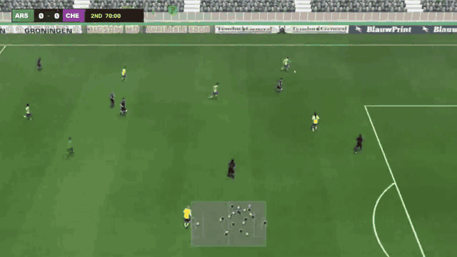
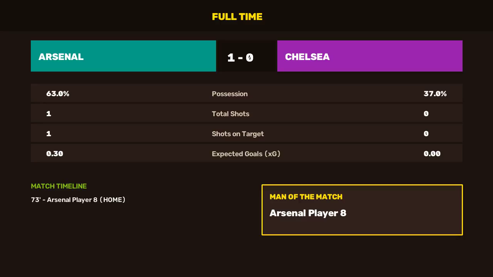
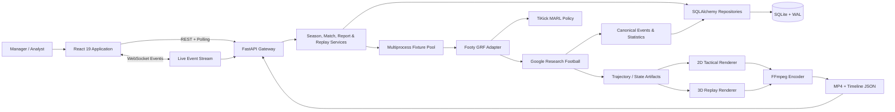
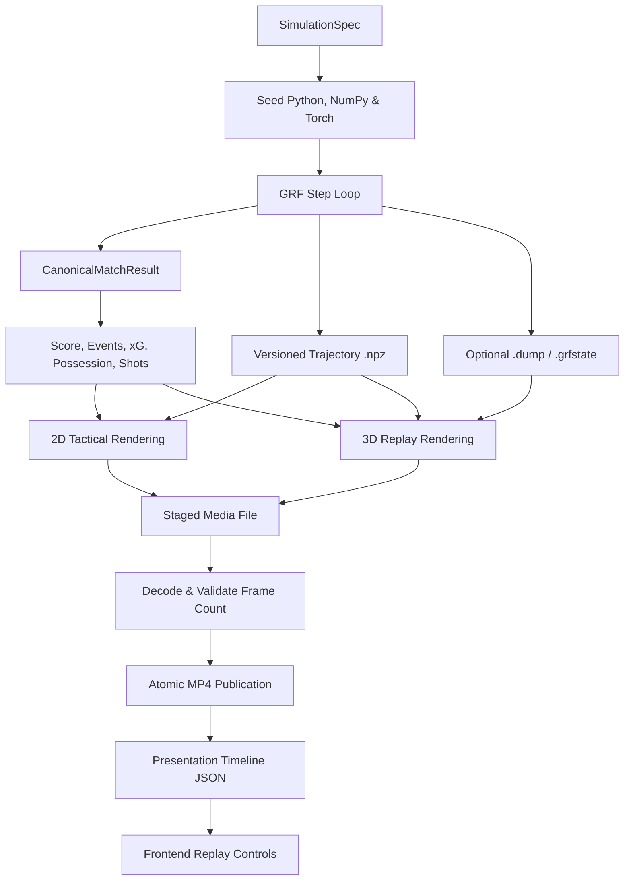

<div align="center">

# ⚽ Footy

### A full-stack football simulation platform powered by Google Research Football

Footy runs 11v11 matches inside Google Research Football, manages entire multi-tier seasons, persists deterministic simulation artifacts, and turns raw environment states into interactive visual analytics and broadcast-style 3D replays.

Built with **FastAPI, React 19, SQLAlchemy, Google Research Football, TiKick, FFmpeg, and PyTorch**.

[](backend/tests)
[](assets/readme/showcase-match.mp4)
[](#engineering-snapshot)
[](#engineering-snapshot)
[](#tests-and-verification)
[](https://www.python.org/)
[](https://react.dev/)
[](https://www.typescriptlang.org/)
[](https://github.com/google-research/football)

<br/>



**11v11 Multi-Agent Physics** · **100% Deterministic Sync** · **5,000+ Steps/sec** · **14 Interactive Surfaces**

[Why Footy](#why-footy) · [Engineering Snapshot](#engineering-snapshot) · [Performance](#simulation-performance) · [Showcase Match](#a-real-generated-match) · [The Platform](#the-platform) · [How It Works](#how-it-works) · [Footy vs GRF](#footy-vs-google-research-football) · [Quick Start](#quick-start)

</div>

---

## Why Footy?

Most football simulators focus either on high-level management logic (calculating match outcomes through probability tables) or on match physics (evaluating isolated reinforcement learning scenarios without persistent consequences).

**Footy explores what happens when both live in the same unified system:** managers make tactical selections and squad rotations, those decisions become simulation parameters, Google Research Football resolves the match via multi-agent reinforcement learning policies, and the resulting physical state is preserved for forensic analysis, 2D tactical breakdowns, and broadcast-style 3D replays.

---

## Engineering Snapshot

| Engineering Surface | Metric / Evidence | Verification Standard |
| :--- | :---: | :--- |
| **Automated Backend Tests** | **95 passed, 9 skipped** | Pytest unit, lifecycle, and GRF integration suite (105 test functions) |
| **Targeted Regression Suites** | **23 passed** | Database schema constraints, foreign keys, and run isolation |
| **API Surface** | **63 routes** | FastAPI REST endpoints, WebSocket channels, and media streaming |
| **Relational Schema** | **41 ORM models** | SQLAlchemy 2.0 entities, SQLite WAL persistence, 5 Alembic revisions |
| **Replay Validation** | **1,634 decoded frames** | H.264 High Profile @ 720p 15fps, verified against canonical score |
| **Product Surfaces** | **14 React pages** | React 19, TypeScript, MUI, Recharts, TanStack Query, and Zustand |
| **Simulation Core** | **11v11 Multi-Agent** | Native Google Research Football environment + TiKick neural policy |
| **Codebase Scale** | **33.2k LOC** | 21,681 lines Python (`backend/src` + `backend/tests`), 11,561 lines TS/TSX |

---

## Simulation Performance

Footy incorporates a dedicated benchmark harness (`backend/benchmarks/`) measuring environment throughput, multi-process fixture scaling, latency distributions, and deterministic execution invariance.

The following data was reproduced on an AMD64 host (32 logical cores, CPU policy inference):

| Workers | Batch Fixtures | Step Target | Replay Mode | Latency (p50) | Throughput | Determinism Check |
| :---: | :---: | :---: | :---: | :---: | :---: | :---: |
| **1** | 1 match | 100 steps | Headless | 20.3 ms | **4,931 steps/s** (49.3 fix/s) | ✅ SHA-256 Verified |
| **1** | 1 match | 200 steps | Headless | 20.1 ms | **9,931 steps/s** (49.6 fix/s) | ✅ SHA-256 Verified |
| **1** | 5 matches | 100 steps | Headless | 101.1 ms | **4,944 steps/s** (49.4 fix/s) | ✅ SHA-256 Verified |
| **1** | 5 matches | 200 steps | Headless | 101.3 ms | **9,870 steps/s** (49.3 fix/s) | ✅ SHA-256 Verified |
| **2** | 1 match | 100 steps | Headless | 20.5 ms | **4,872 steps/s** (48.7 fix/s) | ✅ SHA-256 Verified |

> [!NOTE]
> **Key Profiling Insight:**
> Profiling demonstrated that simulation throughput is primarily constrained by Python-side environment stepping and worker IPC rather than neural policy inference. GPU utilization remained low across scaling runs, which redirected core optimization work toward multiprocess worker isolation, zero-copy trajectory serialization, and bounded FFmpeg encoding pipelines rather than neural acceleration.

---

## A Real Generated Match

This repository includes a verified match generated through the real `/api/v1/match/simulate-grf` endpoint on **6 September 2026**. Arsenal beat Chelsea **1–0**, with Arsenal Player 8 scoring at the 73rd minute.

<div align="center">

### **Arsenal 1 – 0 Chelsea**
**63% Possession** · **1–0 Shots** · **0.30–0.00 xG** · **1,634 Validated Frames** · **H.264 720p**

[▶ Watch Complete 3D Replay (MP4)](assets/readme/showcase-match.mp4) · [Inspect Match JSON](assets/readme/showcase-match.json) · [Inspect Presentation Timeline](assets/readme/showcase-match.timeline.json)

<br/>



</div>

<details>
<summary><strong>🔍 Replay Validation Details</strong></summary>

| Render Property | Verified Value |
| :--- | ---: |
| **Resolution** | 1280 × 720 |
| **Frame Rate** | 15 fps |
| **Video Codec** | H.264 High Profile |
| **Duration** | 108.93 seconds |
| **Frames Decoded** | 1,634 |
| **Output File Size** | 3.60 MiB |
| **Overlay Layers** | Lineup card, scorebug, match clock, minimap radar, event badges, full-time statistics |

</details>

<details>
<summary><strong>⚡ Reproduce the Showcase Request</strong></summary>

```powershell
$body = @{
  match_id        = "readme_showcase_arsenal_chelsea_20260906"
  home_team_name  = "Arsenal"
  away_team_name  = "Chelsea"
  home_formation  = "4-3-3"
  away_formation  = "4-2-3-1"
  max_steps       = 1200
  generate_video  = $true
  record_dump     = $true
  render_mode     = "3d"
} | ConvertTo-Json

Invoke-RestMethod `
  -Method Post `
  -Uri "http://localhost:5001/api/v1/match/simulate-grf" `
  -ContentType "application/json" `
  -Body $body
```

</details>

---

## What Footy Does

| Functional Area | Platform Capabilities |
| :--- | :--- |
| **Match Engine** | Native GRF 11v11 physics, TiKick multi-agent policies, tactical formation transforms, seeded deterministic execution, event and touch attribution |
| **Season Simulation** | Double round-robin scheduling, multi-matchday rounds, standings, player fatigue, training, finances, transfers, youth academy, season rollover |
| **Replay System** | Versioned trajectory NPZ, optional GRF state/dump capture, 2D tactical pitch render, 3D broadcast render, FFmpeg encoding, presentation timelines |
| **Football Data** | Goals, shots, expected goals (xG), possession, passes, fouls, cards, substitutions, tactical lineups, player ratings, and historical career logs |
| **Application Layer** | FastAPI REST and WebSocket services, SQLAlchemy 2.0 repositories, SQLite WAL persistence, TanStack React Query, and Zustand client state |
| **Presentation Layer** | Premier League command center, league tables, player profiles, manager profiles, match center, analytics, AI benchmark suite, broadcast overlays |

---

## What Makes Footy Technically Interesting

* **Real 11v11 Physics Simulation:** Matches run inside Google Research Football's native C++ simulation environment rather than resolving via statistical RNG.
* **Multi-Agent Policy Integration:** TiKick neural policies drive 22 autonomous agents simultaneously with tactical formations and dynamic behavioral transforms.
* **Deterministic Artifact Pipeline:** Seeded execution produces identical trajectory `.npz` files, state archives, and SHA-256 fingerprint verification across replay runs.
* **Failure-Aware Media Publication:** Replay video is encoded to isolated staging paths, drained for FFmpeg errors, verified for decoded frame counts, and atomically published.
* **Full-Stack Simulation Observability:** Output flows directly from physics engine → typed canonical domain result → SQLite WAL → FastAPI WebSocket → React 19 visual analytics & 3D playback.

---

## The Platform

Footy features an adaptive interface supporting seamless **GitHub Light and Dark mode** transitions.

<div align="center">

### Premier League Command Center


</div>

<br/>

| 🏟️ Match Center & Timeline | 🏆 League Standings & Form |
| :---: | :---: |
|  |  |
| *Fixture results, search filters, and timeline replay entry* | *Form, goal differential, standings, and financial context* |
| **👤 Player Database & Attributes** | **📈 Analytics & Demographic Curves** |
|  |  |
| *Attribute radar, market value, potential, and records* | *Competition totals, position distributions, and age curves* |

---

## How It Works

### System Architecture



### Simulation-to-Replay Artifact Flow



> 💡 *For execution sequencing, state-machine artifact lifecycles, and persistence invariants, see the comprehensive [01. System Architecture Documentation](docs/01_architecture.md).*

---

## Key Engineering Decisions

### 1. Canonical Coordinate System
* **Problem:** Home and away teams observe opposite attacking orientations. Passing raw observations into tactical policies leads to duplicated logic and orientation-dependent bugs.
* **Decision:** Normalize both sides into a single canonical attacking orientation before policy evaluation, mirroring directional actions once at the environment boundary.
* **Why:** Eliminates duplicate logic, reduces policy branching, and makes symmetry directly regression-testable.

### 2. Single Canonical Match Result
* **Problem:** Having renderers re-parse scores from video frames or having the database calculate match stats independently causes data desyncs between UI tables and video cards.
* **Decision:** `GRFMatchExecutor` emits a single typed `CanonicalMatchResult` contract owning the score, event stream, and statistical attribution.
* **Why:** Renderers, SQLite repositories, and analytics consumers strictly ingest the canonical result, guaranteeing 100% agreement across all product surfaces.

### 3. Run-Scoped Persistence
* **Problem:** Re-running simulation seasons or executing concurrent benchmarks risks clobbering existing match records and media files on disk.
* **Decision:** Relational entities and filesystem paths bind uniqueness to `(simulation_run_id, season_id, match_number)`.
* **Why:** Historical seasons remain accessible while active queries target explicit or current simulation runs without data collisions.

### 4. Atomic Replay Publication
* **Problem:** An interrupted FFmpeg process or encoding error could leave a partial or corrupt MP4 file in the public assets directory.
* **Decision:** Encoders write to isolated staging paths, drain FFmpeg output, validate that the decoded frame count matches the simulation step count, and atomically rename the file into place.
* **Why:** Incomplete media is never exposed to the client or recorded as a valid database artifact.

---

## Footy vs Google Research Football

| Capability | Google Research Football (GRF) | Footy |
| :--- | :--- | :--- |
| **Domain Scope** | Reinforcement learning research environment | End-to-end football management & simulation platform |
| **Simulation Context** | Isolated 90-second scenarios / individual games | Multi-season league with scheduling, fatigue, and transfers |
| **Domain Model** | Raw observation vectors and action integers | Typed football domain models (clubs, players, events, xG) |
| **Artifact Output** | Raw binary `.dump` / `.replay` files | Typed `.npz` trajectories, manifests, and presentation timelines |
| **Visual Presentation** | Headless or basic OpenGL viewport | Broadcast-style 3D video with scorebugs, clock, and radar overlays |
| **Product Interface** | Python script execution | 14-page React 19 visual analytics & control center |
| **Process Model** | Single environment loop | Multiprocess fixture pool with watchdog supervisor recovery |

---

## Quick Start

### ⚡ 60-Second Setup

```powershell
# 1. Clone repository & create virtual environment
git clone https://github.com/x-Kevin-Paul-x/Footy.git
cd Footy
python -m venv .venv
.venv\Scripts\Activate.ps1
pip install -r requirements.txt

# 2. Launch full stack concurrently (FastAPI on :5001 + React on :5173)
cd frontend
npm install
npm run dev
```

* **Frontend:** `http://localhost:5173`
* **API Gateway:** `http://localhost:5001`
* **Interactive OpenAPI Docs:** `http://localhost:5001/docs`

### 🐳 Docker Services

```powershell
docker compose up --build
```
*Compose serves the frontend on port 80 and the API on port 5001.*

<details>
<summary><strong>🛠️ Manual Backend & Frontend Setup</strong></summary>

#### Backend
```powershell
python -m venv .venv
.venv\Scripts\Activate.ps1
pip install -r requirements.txt
pip install -r requirements-dev.txt
Copy-Item .env.example .env

python backend/src/dev_server.py
```

#### Frontend
```powershell
cd frontend
npm install
Set-Content .env 'VITE_API_BASE_URL=http://localhost:5001'
npm run dev
```

</details>

### Compatibility Matrix

| Environment | Status | Verification Context |
| :--- | :---: | :--- |
| **Windows 11 + WSL2 Ubuntu** | ✅ Primary | Primary development host; C++ GRF compilation and rendering verified |
| **Native Linux (Ubuntu 22.04+)** | ✅ Supported | Native execution for both multi-agent simulation and rendering |
| **Windows Native** | ⚠️ Partial | FastAPI backend and React frontend supported; GRF requires WSL2 |
| **CUDA / GPU Acceleration** | Optional | CPU policy inference is standard; GPU acceleration supported for rendering |

---

## Tests and Verification

All tests verified on the configured Windows/WSL host on **6 September 2026**:

| Test Suite | Command | Result | Coverage Area |
| :--- | :--- | :---: | :--- |
| **Backend Integration Suite** | `pytest backend/tests -v` | **95 passed, 9 skipped** | Simulation lifecycle, determinism, and API |
| **Targeted Regressions** | `pytest backend/tests/test_audit_regressions.py` | **23 passed** | Database schema constraints and run isolation |
| **Frontend Jest Suite** | `npm test -- --runInBand` | **6 passed** | Client state transitions and utility transforms |
| **TypeScript Typecheck** | `npx tsc --noEmit` | **Passed** | Strict typechecking across 37 TS/TSX modules |
| **Production Build** | `npm run build` | **Passed** | 2,225 modules transformed in 4.51 seconds |
| **SQLite Schema Health** | `PRAGMA integrity_check;` | **`ok`** | Zero orphaned rows or foreign-key violations |

---

## Repository at a Glance

```text
Footy/
├── backend/
│   ├── alembic/                 database schema migrations
│   ├── benchmarks/              performance measurement harness and results
│   ├── data/                    SQLite database, saves, and match records
│   ├── reports/                 recordings, trajectories, and presentation artifacts
│   ├── src/
│   │   ├── api_fastapi.py       HTTP, WebSocket, and media delivery routes
│   │   ├── database/            SQLAlchemy models, repositories, and sessions
│   │   ├── logic/               GRF runners, replay engine, and season scheduling
│   │   ├── ml/                  DQN manager brain and evaluation routines
│   │   └── models/              football domain entities (clubs, players, fixtures)
│   └── tests/                   unit, regression, and GRF determinism tests
├── frontend/
│   ├── src/components/          formation viewer, replay player, charts, and tables
│   ├── src/pages/               14 product surfaces (dashboard, match center, analytics)
│   ├── src/services/            typed Axios client and WebSocket hooks
│   └── src/store/               Zustand simulation state store
├── assets/readme/               theme-aware screenshots and showcase match artifacts
└── docs/                        detailed architecture, logic, models, and setup guides
```

---

## Documentation

* [01. System Architecture](docs/01_architecture.md) — Detailed layer interactions, sequence diagrams, and lifecycle states
* [02. Backend & Simulation Logic](docs/02_backend_logic.md) — Match executor, season scheduler, and replay pipeline
* [03. Data Models & Artifacts](docs/03_data_models.md) — Relational schema, trajectory specifications, and manifests
* [04. Frontend Guide](docs/04_frontend_guide.md) — Component architecture, state management, and theme system
* [05. Current Implementation Status](docs/05_current_status.md) — Verified test evidence and component health
* [06. Setup & Execution](docs/06_setup_and_run.md) — WSL2 environment configuration and dependency setup
* [07. Backend Remediation Plan](docs/Backend_audit_PLAN.md) — Architectural roadmap and remediation tracking

---

## Current Limitations

Footy is under active engineering development. Known limitations are openly documented and actively remediated in the project backlog:

<details>
<summary><strong>🔍 Known Engineering Limitations & Active Remediation Work</strong></summary>

* **Alembic Bootstrap:** Repairing fresh-database Alembic bootstrap sequence for zero-state database initialization.
* **Durable Job Tracking:** Migrating background simulation and ML tasks to durable job IDs with heartbeat leases.
* **Worker Queue Invariant:** Closing the worker dequeue-before-ownership window in the multiprocessing fixture pool.
* **Frame-Accurate Timelines:** Standardizing presentation timeline generation across 2D trajectory and 3D dump renderers.
* **Pickle Deserialization:** Replacing legacy pickle deserialization with explicit, typed schema validation.
* **Path Containment:** Enforcing resolved path containment across all artifact export and media delivery endpoints.
* **Multiprocess Scaling Harness:** Expanding synthetic benchmarks into distributed multi-node fixture execution.
* **Domain/ORM Class Collision:** Renaming domain `Match` entity shadowing the ORM `Match` model in the API link persistence path.

</details>

---

## Built On & Acknowledgments

* **[Google Research Football](https://github.com/google-research/football)** — Reinforcement learning football simulation environment.
* **[TiKick](https://github.com/OpenDriveLab/TiKick)** — Multi-agent reinforcement learning football policies.
* **[PyTorch](https://pytorch.org/)** — Neural policy execution and tensor manipulation.
* **[FastAPI](https://fastapi.tiangolo.com/)** & **[SQLAlchemy](https://www.sqlalchemy.org/)** — Asynchronous API gateway and relational persistence.
* **[React](https://react.dev/)** & **[MUI](https://mui.com/)** — Component framework and visual design system.
* **[FFmpeg](https://ffmpeg.org/)** — Replay video transcoding and broadcast stream generation.

---

<div align="center">

Built with ⚽ by **[Kevin Paul](https://github.com/x-Kevin-Paul-x)**

</div>
