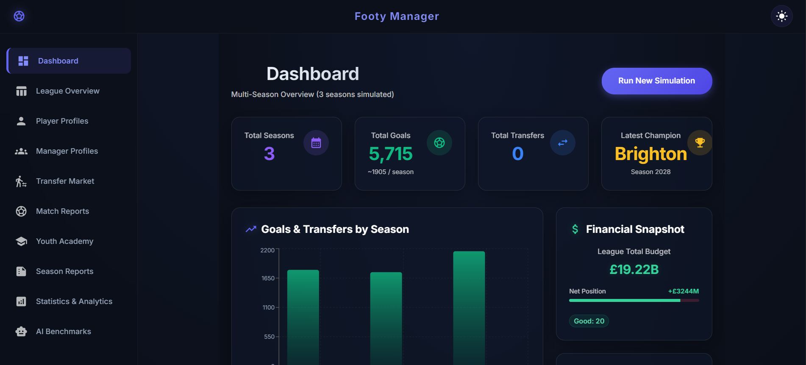
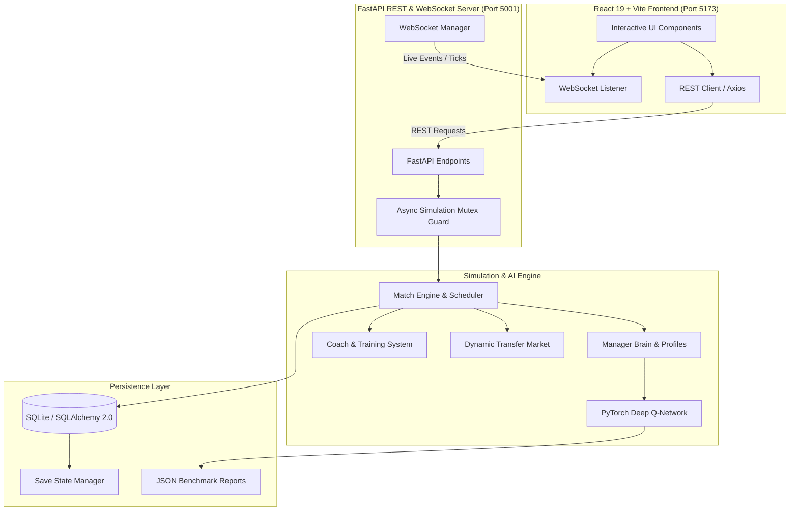

# ⚽ Footy: AI-Driven Football League Simulation & Reinforcement Learning Engine

[](https://www.python.org/)
[](https://fastapi.tiangolo.com/)
[](https://pytorch.org/)
[](https://react.dev/)
[](https://vitejs.dev/)
[](https://tailwindcss.com/)
[](LICENSE)

**Footy** is a full-stack, AI-driven football (soccer) league simulation engine. It models comprehensive football management—including dynamic team rosters, player growth and training systems, minute-by-minute match mechanics, financial budgets, youth academy scouting, and an active transfer market. 

At its core, Footy integrates **Reinforcement Learning (RL)** and **Deep Q-Networks (DQN)** for manager decision-making, allowing AI managers to adapt squad tactics, player acquisitions, and financial investments over multi-season careers.

---



---

## 🌟 Key Features

### 🖥️ 1. Modern Full-Stack Dashboard & Interactive UI
* **14 Dedicated Views**: Dashboard, League Standings, Team Details, Player Profiles, Manager AI Logs, Transfer Market, Match Reports, Season Archives, Analytics & Statistics, AI Benchmarks, and Youth Academy.
* **Live WebSocket Streaming**: Real-time server-sent events (`/ws`) stream match ticks, goal alerts, transfer updates, and simulation progress directly to the frontend.
* **Interactive Charts & Visualizations**: Powered by **Recharts** and **Chart.js** for attribute breakdowns, team standings progression, financial analytics, and RL training rewards.

### 🤖 2. Manager AI Brain & Reinforcement Learning (DQN)
* **Tabular Q-Learning & Deep Q-Networks (PyTorch)**: AI managers select optimal lineups, make transfer bids, and manage squad budgets.
* **Personality Profiles**: Distinct manager archetypes (*Tactical Mastermind*, *Financially Focused*, *Risk Taker*, *Youth Developer*) that shape reward signals and tactical decisions.
* **CLI Evaluation & Comparison Suite**: Evaluate trained models against heuristics (*Random*, *Do Nothing*) and generate side-by-side benchmark reports for multi-checkpoint analysis.

### ⚽ 3. Simulation & Match Engine
* **20-Team Premier League Simulation**: Automated round-robin schedule generator and realistic match resolution algorithm.
* **Comprehensive Player Growth**: Attribute-level progression influenced by coach specializations (Attacking, Defending, Physical), age development curves, and match minutes.
* **Dynamic Transfer Market**: AI-driven bidding, value estimations based on potential and age, contract management, and sell/buy negotiations.
* **Youth Academy & Scouting**: Scout, develop, and promote high-potential wonderkids into the senior squad.

### 💾 4. Persistence & Save-State Engine
* **SQLAlchemy 2.0 & SQLite Persistence**: Fully transactional database layer replacing raw ephemeral scripts.
* **Multi-Season Career Saves**: Save and load simulation states (`/saves`) to preserve league history across multiple seasons without data loss.

---

## 🏗️ System Architecture



---

## 📁 Project Structure

```
Footy/
├── backend/                  # Python Backend & AI Engine
│   ├── src/
│   │   ├── api_fastapi.py    # FastAPI REST & WebSocket endpoints
│   │   ├── config.py         # Runtime configuration & environment variables
│   │   ├── main.py           # Core simulation entry point
│   │   ├── schemas.py        # Pydantic data schemas
│   │   ├── database/         # SQLAlchemy ORM models, session & DB access
│   │   ├── logic/            # Manager brain, Q-learning, & personality profiles
│   │   ├── ml/               # PyTorch DQN agent, environment, training & eval scripts
│   │   └── models/           # Domain models (League, Team, Player, Match, Coach, Transfer)
│   ├── tests/                # Pytest unit and integration test suite
│   └── data/                 # SQLite database & save-state files
│
├── frontend/                 # React + Vite Frontend
│   ├── src/
│   │   ├── components/       # Reusable UI components & navigation
│   │   ├── pages/            # 14 Application view pages
│   │   ├── services/         # Axios API services & WebSocket client
│   │   └── store/            # State management (Zustand & React Query)
│   ├── package.json          # Node dependencies & npm scripts
│   └── vite.config.ts        # Vite configuration
│
├── ml/                       # Saved PyTorch models & benchmark JSON reports
│   ├── models/               # dqn_best.pt, dqn_final.pt
│   └── reports/              # Benchmark & checkpoint comparison reports
│
├── docs/                     # Architectural documentation & design specs
├── docker-compose.yml        # Multi-container Docker orchestration
├── backend.Dockerfile        # Production Dockerfile for Python FastAPI backend
├── frontend.Dockerfile       # Multi-stage Dockerfile for React/Nginx frontend
├── requirements.txt          # Python dependencies
├── requirements-ml.txt       # Machine learning dependencies (PyTorch, Gymnasium)
└── README.md                 # Project Documentation
```

---

## ⚡ Quick Start Guide

### Prerequisites
* **Python**: `3.10` or higher
* **Node.js**: `18.0` or higher (with `npm`)

### 1. Environment Setup

Clone the repository and set up environment files:

```bash
# Copy example environment files
copy .env.example .env
copy frontend\.env.example frontend\.env
```

### 2. Install Dependencies

**Backend Python dependencies:**
```bash
# Create virtual environment (optional but recommended)
python -m venv .venv
.venv\Scripts\activate      # Windows (or source .venv/bin/activate on Linux/Mac)

# Install core dependencies
pip install -r requirements.txt

# Install ML dependencies (optional for DQN training)
pip install -r requirements-ml.txt
```

**Frontend Node dependencies:**
```bash
cd frontend
npm install
cd ..
```

### 3. Initialize Database

Run the database setup script to seed initial teams, players, and managers:

```bash
$env:PYTHONPATH="backend/src"; python backend/src/database/db_setup.py
```

### 4. Running the Application

You can launch both the backend API server and frontend development server concurrently:

```bash
cd frontend
npm run dev
```

* **Frontend Dashboard**: [http://localhost:5173](http://localhost:5173)
* **Backend API Docs**: [http://localhost:5001/docs](http://localhost:5001/docs)
* **Health Check**: [http://localhost:5001/health](http://localhost:5001/health)

Alternatively, launch services separately:

```bash
# Terminal 1: Run FastAPI Backend
$env:PYTHONPATH="backend/src"; python -m uvicorn api_fastapi:app --app-dir backend/src --reload --port 5001

# Terminal 2: Run Vite Frontend
cd frontend
npx vite
```

---

## 🧠 Reinforcement Learning & ML Pipeline

The RL system empowers AI managers to learn effective squad building and financial strategies over time.

### Training the DQN Agent
Train a Deep Q-Network agent across multiple simulation seasons:
```bash
$env:PYTHONPATH="backend/src"; python backend/src/ml/train_rl.py train --episodes 50
```

### Evaluating Saved Models
Evaluate a trained model against baseline heuristics (*Random*, *Do-Nothing*):
```bash
$env:PYTHONPATH="backend/src"; python backend/src/ml/train_rl.py eval --model ml/models/dqn_best.pt --episodes 10 --fast-mode
```

### Comparing Checkpoints
Generate multi-checkpoint comparison reports to track progression across training iterations:
```bash
$env:PYTHONPATH="backend/src"; python backend/src/ml/train_rl.py compare --models ml/models/dqn_best.pt ml/models/dqn_final.pt --episodes 10 --fast-mode
```
*Reports are saved as structured JSON in `ml/reports/` and visualized directly on the **AI Benchmarks** frontend page.*

---

## 📡 REST API Reference

| Endpoint | Method | Description |
| :--- | :--- | :--- |
| `/health` | `GET` | API health check status |
| `/run-simulation` | `POST` | Trigger asynchronous simulation task with mutex lock guard |
| `/teams` | `GET` | List all league teams, budgets, and wage structures |
| `/players` | `GET` | List player roster with attributes and roles |
| `/saves` | `GET` | List all available simulation save game states |
| `/saves/save` | `POST` | Create a persistent save point of the current database |
| `/saves/load/{id}`| `POST` | Load a previously saved league state |
| `/ws` | `WebSocket` | Real-time simulation event stream (match ticks, goals, logs) |

---

## 🧪 Testing

### Running Backend Tests
Execute unit and integration tests with `pytest`:
```bash
$env:PYTHONPATH="backend/src"; pytest backend/tests/
```

### Running Frontend Tests
Execute frontend unit tests with `Jest`:
```bash
cd frontend
npm test
```

---

## 🐳 Docker Deployment

Run the complete production stack using Docker Compose:

```bash
docker-compose up --build
```
* Access the web application at `http://localhost`.

---

## 📄 License

This project is licensed under the **MIT License** - see the `LICENSE` file for details.

## 👤 Author & Maintainer

* **Kevin Paul** - [GitHub Profile](https://github.com/x-Kevin-Paul-x)
