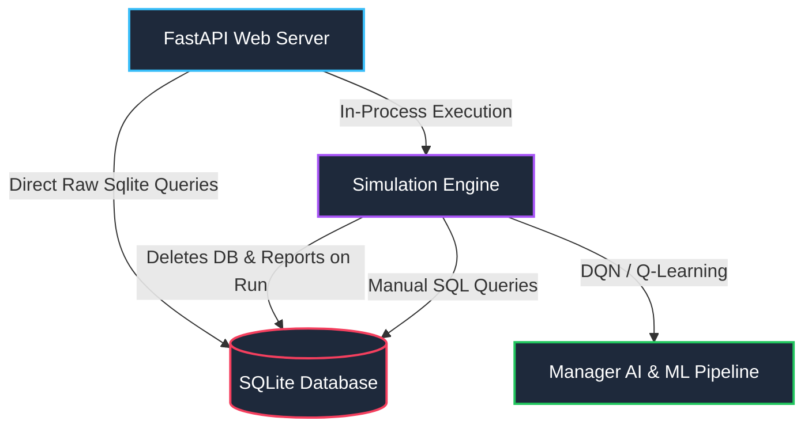
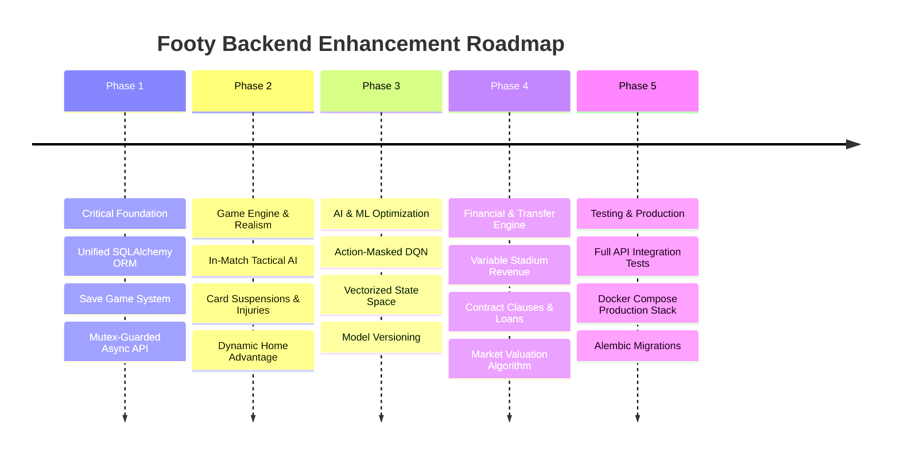

# Comprehensive Backend Audit & Enhancement Roadmap

## 1. Executive Summary

A comprehensive architectural and code-level audit was conducted across the **Footy** backend system. Footy is an ambitious, high-potential Python/FastAPI-based football simulation and AI engine. The project features impressive concepts, including a custom match engine, Deep Q-Learning (DQN) manager AI, automated financial modeling, and real-time WebSocket reporting.

However, several critical architectural bottlenecks, data persistence flaws, concurrency risks, and simulation engine gaps currently hinder performance, data durability, and scalability. This audit details findings across **6 Core Domains** and provides an actionable step-by-step roadmap to transform Footy into a production-grade, highly scalable system.

---

## 2. Comprehensive Audit Findings



### 2.1 Database & Persistence Architecture

> [!CAUTION]
> **Data Loss Risk**: `initialize_database()` in [main.py](file:///c:/Users/kevin/OneDrive/Desktop/Projects/Footy/backend/src/main.py#L22-L41) drops and rebuilds all tables and unlinks all JSON reports every time a simulation is triggered. There is no multi-season history retention or save-state management.

* **Dual Data Layer Pattern**: The backend maintains SQLAlchemy models in [models.py](file:///c:/Users/kevin/OneDrive/Desktop/Projects/Footy/backend/src/database/models.py), yet every database operation ([team_db.py](file:///c:/Users/kevin/OneDrive/Desktop/Projects/Footy/backend/src/database/team_db.py), [player_db.py](file:///c:/Users/kevin/OneDrive/Desktop/Projects/Footy/backend/src/database/player_db.py), [match_db.py](file:///c:/Users/kevin/OneDrive/Desktop/Projects/Footy/backend/src/database/match_db.py)) bypasses SQLAlchemy ORM and executes raw `sqlite3` strings with positional tuple indexing (`t[0]`, `t[1]`). This creates duplicate schemas, breaking relationship navigation and type safety.
* **Connection Lifecycle Overhead**: SQLite connections (`sqlite3.connect(DB_FILE)`) are opened and closed synchronously inside every helper function call. Under high concurrent query loads or active simulation steps, this leads to SQLite database lock errors (`OperationalError: database is locked`).
* **Missing Foreign Key Enforcement & Migrations**: SQLite foreign key constraints are not explicitly enabled upon connection establishment (`PRAGMA foreign_keys = ON`), allowing orphan records. Alembic is present in the repository but unintegrated with schema changes.

### 2.2 FastAPI Server & Concurrency Model

> [!WARNING]
> Launching `/run-simulation` starts `run_simulation_task` in an asyncio thread executor without a concurrency mutex or job status guard. Multiple user requests will trigger overlapping simulations, corrupting SQLite files and race-deleting report directories.

* **Lack of Pydantic Response Validation**: Endpoints like `/teams`, `/players`, and `/season-reports` construct raw lists of Python standard dicts without `response_model` definitions, exposing internal database schema structures and risking runtime serialization errors.
* **Coarse Exception Handling**: REST endpoints wrap failures in generic `except Exception as e: raise HTTPException(status_code=500, detail=str(e))`, leaking stack traces and returning uninformative error payloads.
* **WebSocket Streaming Limitations**: The `/ws` connection streams unstructured text messages (`json.dumps({"type": "log", "message": "..."})`) rather than typed event streams (e.g. `MATCH_TICK`, `GOAL_SCORED`, `SEASON_END`), making granular real-time UI synchronization difficult.

### 2.3 Game Engine & Match Realism

* **Match Engine Computational Bottleneck**: Minute-by-minute simulation loops compute full team ratings and random probability checks every minute. While `FAST_MODE` exists in [match.py](file:///c:/Users/kevin/OneDrive/Desktop/Projects/Footy/backend/src/models/match.py#L9-L36), it is toggled via global state rather than a configurable simulation mode.
* **TACTICAL & MID-MATCH ADAPTATION GAPS**:
  * AI managers do not make dynamic in-match tactical adjustments (e.g., switching to ultra-defensive when leading at minute 85).
  * Substitutions occur based on static stamina thresholds rather than tactical performance, injuries, or red card compensations.
* **Injury & Disciplinary Accumulation**: Yellow/red cards are tracked per match, but multi-match suspensions, card accumulators, and persistent injury recovery timelines (e.g., 3-week hamstring tear) are missing.
* **Home Advantage & Weather Balancing**: Home advantage applies a flat 10% rating multiplier. Stadium capacity, fan attendance, and pitch surface condition effects are not dynamically factored into match momentum.

### 2.4 Reinforcement Learning (ML/RL) & AI Manager Brain

* **State Space Sparsity**: The tabular Q-learning `StateEncoder` in [manager_brain.py](file:///c:/Users/kevin/OneDrive/Desktop/Projects/Footy/backend/src/logic/manager_brain.py#L8-L115) discretizes 12 continuous metrics into a high-dimensional state tuple. This results in exponential state space explosion ($>10^6$ states), causing severe state sparsity where 95%+ of states are never visited during training.
* **Unconstrained Action Space**: The Deep Q-Network (DQN) agent predicts transfer and tactical decisions across a static action index without invalid action masking. AI managers can select actions to buy players costing more than their available transfer budget.
* **Hardcoded Model Paths**: Model loading in [main.py](file:///c:/Users/kevin/OneDrive/Desktop/Projects/Footy/backend/src/main.py#L95-L98) relies on hardcoded string filenames (`dqn_best.pt`) with fallback silent defaults.

### 2.5 Financial & Transfer Engine

* **Static Economic Model**: Team revenues are static or simplistic. Stadium ticket sales, tier-based broadcasting rights, performance bonuses (e.g. Champions League qualification), and sponsorship scaling with team popularity are under-developed.
* **Transfer Window Duration & Rules**: Transfer windows operate on simple day counters rather than authentic FIFA transfer windows (Summer vs January). Advanced contracts (release clauses, sell-on fees, buy-back options, loan deals with wages split) are missing.

### 2.6 Testing & Environment Configuration

* **Implicit Test Dependencies**: Tests required manual `PYTHONPATH` manipulation (`$env:PYTHONPATH="backend/src"`) to resolve imports. Running `pytest` out of the box failed initially during module collection.
* **Test Scope**: Existing unit tests cover basic initialization and report reads, but lack simulation integration tests, API integration tests (`TestClient`), concurrent request stress tests, and ML reward convergence tests.

---

## 3. Recommended Optimization Blueprint

| Domain | Issue / Bottleneck | Recommended Solution | Impact Level |
| :--- | :--- | :--- | :--- |
| **Database** | Dual raw `sqlite3` vs SQLAlchemy ORM; data wiped every run. | Standardize fully on SQLAlchemy 2.0 ORM sessions, add Alembic migrations, and introduce persistent save games. | **CRITICAL** |
| **API / Server** | Non-thread-safe background simulation triggering & missing Pydantic schemas. | Implement Celery/Redis or asyncio `Lock` guard, add Pydantic schemas, and return typed WebSocket event frames. | **HIGH** |
| **Game Engine** | Static mid-match tactics, missing suspensions, flat home advantage. | Add dynamic in-match AI decision tree, card accumulators/suspensions, and stadium capacity momentum scaling. | **HIGH** |
| **AI / ML** | Tabular Q-state explosion; unmasked invalid DQN transfer actions. | Standardize on DQN with Action Masking (PyTorch), reduce state dimension, and log rewards via TensorBoard. | **HIGH** |
| **Economics** | Static budgets; simple transfers without clauses or loans. | Implement dynamic revenue streams (tickets, broadcasting, sponsors) and structured transfer negotiation engine. | **MEDIUM** |
| **Testing & CI** | Import path issues; missing API integration tests. | Add `pyproject.toml` editable package setup (`pip install -e .`), add `httpx` FastAPI test suite. | **MEDIUM** |

---

## 4. Priority Implementation Roadmap



### Phase 1: Critical Foundation (Week 1)
1. **Unify Database Layer**: Refactor `database/*_db.py` to use SQLAlchemy 2.0 async/sync ORM sessions with `SessionLocal` dependency injection. Enable SQLite foreign key constraints.
2. **Save-State Persistence**: Remove data wiping on simulation start. Introduce save game slots (`/saves`, `/load/{save_id}`) so seasons build history over time.
3. **API Thread Safety & Pydantic**: Add a global `asyncio.Lock()` to `/run-simulation` to enforce single active simulation run. Define Pydantic schemas (`TeamRead`, `PlayerRead`, `MatchReportRead`).

### Phase 2: Game Engine & Match Realism (Week 2)
1. **In-Match AI Tactics**: Add manager decision loops at 45', 60', and 75' minutes where managers change formation/mindset based on scoreline and fatigue.
2. **Suspension & Injury Tracking**: Implement match ban counters for red cards / cumulative yellow cards, and multi-week injury recovery states affecting squad availability.
3. **Structured WebSocket Streaming**: Upgrade WebSocket payload to JSON event framing:
   ```json
   {
     "event": "MATCH_GOAL",
     "data": { "minute": 34, "scorer": "Bukayo Saka", "team": "Arsenal", "score": [1, 0] }
   }
   ```

### Phase 3: AI Manager & ML Pipeline Upgrade (Week 3)
1. **Action-Masked Deep Q-Network**: Integrate invalid action masking in [dqn_agent.py](file:///c:/Users/kevin/OneDrive/Desktop/Projects/Footy/backend/src/ml/dqn_agent.py) to prevent managers from choosing unaffordable transfers or invalid squad setups.
2. **State Space Dimension Reduction**: Replace high-dimensional tabular state tuple with continuous vectorized representations for DQN neural network input.
3. **Model Registry & Tracking**: Save models with standard metadata (`dqn_v1_season10.pt`, metric logs) and configure MLflow or TensorBoard tracking.

### Phase 4: Financial Engine & Advanced Features (Week 4)
1. **Dynamic Revenues**: Calculate stadium income per home match (`attendance * ticket_price`), tiered broadcasting pay-outs by league finish position, and performance-based sponsorship deals.
2. **Enhanced Transfers**: Add support for loan deals with buy options, sell-on percentages, release clauses, and wage demands scaling with player rating and potential.

---

## 5. Verification & Testing Strategy

To ensure code quality and prevent regression during backend refactoring:

1. **Automated Unit & Integration Test Suite**:
   ```bash
   # Run backend tests with coverage
   pytest backend/tests --cov=backend/src -v
   ```
2. **API Endpoint Verification**:
   * Utilize `httpx.AsyncClient` or FastAPI `TestClient` to verify status codes, error payloads, and Pydantic schema validation.
3. **Simulation Convergence Benchmark**:
   * Execute 10-season head-to-head benchmarking to verify simulation balance (league win distributions, goal averages, transfer market inflation metrics).
