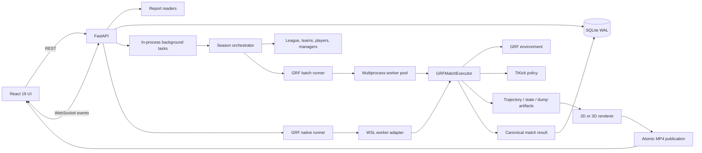
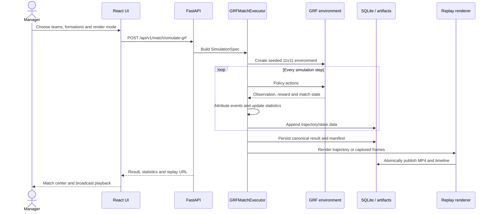
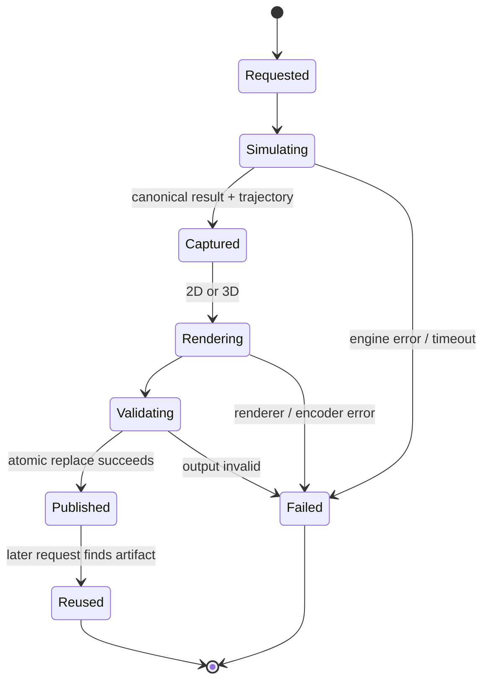

# 01. System Architecture

Last verified: **6 September 2026**

Footy combines a Python football-management domain, Google Research Football (GRF) match execution, SQLite persistence, replay/video generation, a FastAPI application, and a React frontend.

## Component and data flow

## Main layers

| Layer | Main paths | Responsibility |
| --- | --- | --- |
| Domain | `backend/src/models/` | League schedule, teams, players, managers, matches, training, transfers, finance. |
| Orchestration | `backend/src/main.py` | Builds the world, runs matchdays, persists results, writes reports, rolls seasons forward. |
| Canonical match engine | `backend/src/logic/simulation/match_executor.py` | Environment lifecycle, seed setup, canonical observations, actions, events, statistics, trajectories, and results. |
| Execution adapters | `grf_native_runner.py`, `grf_batch_runner.py`, `simulation_process_pool.py`, `wsl_workers/` | Windows/WSL transport, batch construction, multiprocessing, retries, and compatibility. |
| Replay/rendering | `grf_renderer.py`, `logic/replay/`, `presentation_timeline.py` | 2D trajectory video, live AVI overlay/transcode, persistent 3D state replay, FFmpeg encoding, timeline metadata. |
| Persistence | `backend/src/database/`, `backend/alembic/` | SQLAlchemy models/repositories, WAL settings, save/restore, schema migration. |
| HTTP application | `backend/src/api_fastapi.py`, `schemas.py` | REST/WebSocket routes, validation, streaming, simulation and render triggers. |
| Frontend | `frontend/src/` | Dashboard, reports, details, settings, render controls, polling, charts. |

## Authoritative data

`CanonicalMatchResult` is the result contract emitted by `GRFMatchExecutor`. A `MatchTrajectory` contains typed NumPy arrays plus a `MatchManifest`. Optional `.grfstate` archives contain C++ environment states for 3D restoration. Match rows and events persist the result used by reports and the UI.

The intended rule is that rendering consumes recorded results and artifacts. Current paths follow that rule for score/event overlays, but renderer frame inserts are not yet represented by one exact timeline profile. See [Current Status](05_current_status.md).

## Match execution sequence

## Match artifact lifecycle

## Scheduling and season lifecycle

`League.generate_schedule()` creates explicit matchday rounds with the circle method. `main.py` prepares and simulates each round, persists successful results under a `simulation_run_id`, applies weekly domain changes, writes season reports, and advances the season after successful completion.

## Concurrency model

- FastAPI season and ML work currently runs in process-local background tasks.
- Season simulation uses a multiprocessing worker pool for fixtures.
- Replay pipelines use a bounded producer/consumer queue between rendering and FFmpeg.
- SQLite uses WAL and still allows one writer at a time.
- The API lock and background task ownership do not coordinate multiple API processes or survive restart.

## Artifact layout

The configured report root contains season reports, transfer logs, match reports, recordings, trajectories, state archives, render progress files, and ML reports. Runners accept a `run_id` and can place recordings in run directories. Compatibility lookup still searches legacy filenames, so callers should use DB-provided artifact URLs rather than construct paths.

## Known architecture gaps

1. Simulation/render work is not a durable queue with leases.
2. The worker pool has a dequeue-before-ownership crash window.
3. Match/artifact lookup is not uniformly run-scoped across all compatibility routes.
4. `api_fastapi.py` mixes routing, persistence, filesystem access, report construction, and orchestration.
5. Alembic cannot bootstrap an empty database.
6. Timeline metadata is not exact for every renderer.
7. Full-state archive deserialization is safe only for trusted local artifacts.

