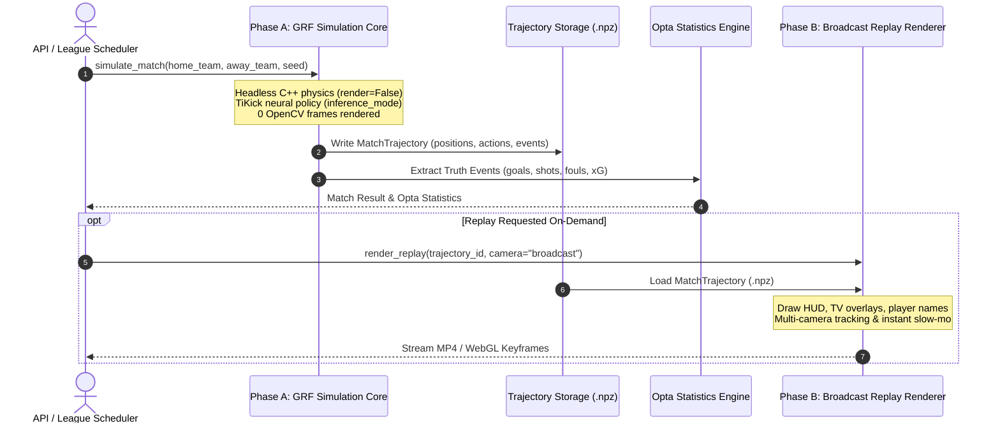
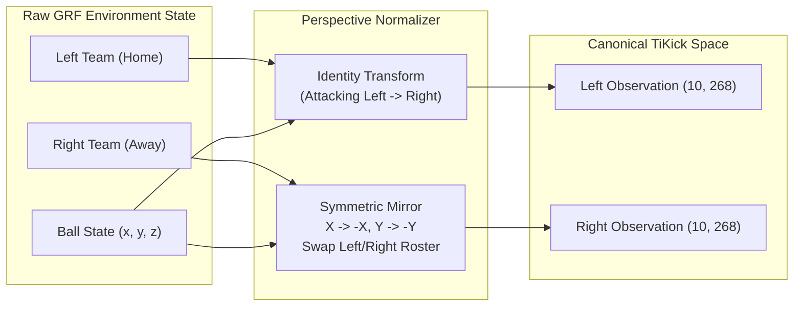
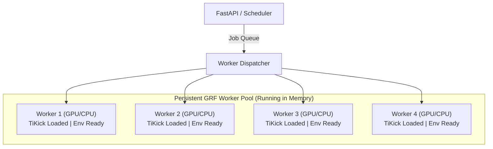

# 02. Backend Logic & Simulation Mechanics

This document provides the complete technical specification for Footy's backend simulation engine, Google Research Football (GRF) MARL integration, trajectory logging, player attribute mapping, and Deep RL manager brains.

---

## 1. The Core Architecture: Two-Phase Decoupled Pipeline

Footy strictly separates **simulation physics** from **video rendering**:



### Key Performance Benefits
1. **Simulation Throughput**: Simulating headless without rendering runs at **$500–2000+$ matches/hour** on modern GPUs.
2. **True Replay Guarantee**: Replaying a match never invokes the TiKick neural policy or re-runs physics. The replay draws directly from the recorded `MatchTrajectory`, guaranteeing $100\%$ score, goalscorer, minute, and movement parity.
3. **Multi-Camera On Demand**: Any camera angle (TV Main, Tactical High-Angle, Behind Goal, Player Focus) or slow-motion instant replay can be rendered from the same stored trajectory artifact.

---

## 2. Canonical GRF Simulation Engine

### Consolidated Single Path
Footy maintains a single canonical GRF engine (`FootyGRFSimulator`) replacing legacy fragmented scripts. Every execution path—whether single API test, season matchday batch, or headless benchmark—uses the exact same environment configuration and random seed algorithm:

$$\text{Seed} = \text{MD5}(\text{"match\_" } + \text{Season} + \text{"\_"} + \text{HomeID} + \text{"\_"} + \text{AwayID}) \pmod{100\,000}$$

### Determinism Hierarchy
Rather than overclaiming unconditional cross-machine bit-for-bit parity, Footy defines 4 strict levels of determinism:

| Determinism Level | Scope | Guarantee | Technical Requirements |
| :--- | :--- | :--- | :--- |
| **Level 1 (In-Process)** | Same process | 100% Identical bit-for-bit | Identical seed & PRNG state |
| **Level 2 (Single-Machine)** | Same machine / OS | 100% Identical bit-for-bit | Fixed CUDA algorithms, `deterministic=True`, `physics_steps_per_frame=1` |
| **Level 3 (Environment)** | Identical Docker / WSL | 100% Parity | Identical GRF build, PyTorch CUDA kernel version |
| **Level 4 (Cross-Platform)** | Windows / Linux / CPU | Statistically Equivalent | Consistent random distributions |

---

## 3. Perspective-Aware Feature Extraction (TiKick Fix)

In 11v11 Multi-Agent Reinforcement Learning, the neural policy (`actor.pt`) was trained from the canonical perspective (attacking left-to-right). Feeding the right-side team directly with left-side coordinate definitions causes inverted strategic decisions.

Footy applies **Canonical Perspective Normalization**:



### Mathematical Transform for Right Team
1. **Coordinates**: $x_{\text{can}} = -x$, $y_{\text{can}} = -y$, $v_{x,\text{can}} = -v_x$, $v_{y,\text{can}} = -v_y$.
2. **Team Arrays**: `ally` is set to `right_team`, `enemy` is set to `left_team`.
3. **Action Inversion**: Discrete directional actions selected by the policy for right agents ($1–8$) are mapped back symmetrically to GRF pitch vectors before `env.step()`.

---

## 4. Footy Player Attributes $\to$ GRF Parameter Adapter

GRF does not natively understand Football Manager stats. The `FootyGRFAdapter` maps high-level ratings into physical and tactical multipliers:

```python
class FootyGRFAdapter:
    """
    Translates Footy squad attributes into calibrated simulation modifiers.
    """
    @staticmethod
    def map_player_profile(player: FootballPlayer) -> GRFPlayerProfile:
        stats = player.stats
        return GRFPlayerProfile(
            speed_multiplier       = 0.85 + (stats.get("pace", 70) / 100.0) * 0.30,      # 0.85 - 1.15x
            acceleration_multiplier= 0.90 + (stats.get("acceleration", 70) / 100.0) * 0.20,
            shot_power_multiplier  = 0.80 + (stats.get("shooting", 70) / 100.0) * 0.40,
            pass_accuracy_bias     = (stats.get("passing", 70) - 70) / 100.0 * 0.15,
            tackle_success_rate    = 0.50 + (stats.get("tackling", 70) / 100.0) * 0.40,
            stamina_depletion_rate = 1.20 - (stats.get("stamina", 70) / 100.0) * 0.40,
        )
```

### Formation Spatial Anchoring
Formations (`4-3-3`, `4-2-3-1`, `3-5-2`, `5-3-2`, `4-4-2`) define the initial spawn coordinates and dynamic defensive rest positions for each agent index ($0=\text{GK}$, $1..4=\text{Defenders}$, $5..8=\text{Midfielders}$, $9..10=\text{Forwards}$).

---

## 5. `MatchTrajectory` Binary Specification

Matches are serialized into compact, high-efficiency `.npz` binary files:

$$\text{Memory Size} \approx 1200 \text{ frames} \times 23 \text{ entities} \times 4 \text{ bytes} \approx 110\text{ KB per match}$$

```python
@dataclass
class MatchTrajectory:
    match_id: str
    season_year: int
    seed: int
    engine_version: str
    checkpoint_sha256: str
    home_team_id: int
    away_team_id: int
    
    # Quantized Spatial Arrays
    ticks: np.ndarray             # shape: (T,), dtype: uint16
    player_positions: np.ndarray  # shape: (T, 22, 2), dtype: float16
    player_directions: np.ndarray # shape: (T, 22, 2), dtype: float16
    ball_position: np.ndarray     # shape: (T, 3), dtype: float16
    ball_velocity: np.ndarray     # shape: (T, 3), dtype: float16
    
    # Discrete Action & Event Stream
    actions: np.ndarray           # shape: (T, 20), dtype: uint8
    ball_owner_team: np.ndarray   # shape: (T,), dtype: int8 (-1, 0, 1)
    ball_owner_player: np.ndarray # shape: (T,), dtype: int8 (0..10)
    score_timeline: np.ndarray    # shape: (T, 2), dtype: uint8
    events: List[Dict[str, Any]]  # Structured goals, cards, shots, fouls
```

---

## 6. Truth-Based Statistics Engine

All statistics are derived directly from the physical match timeline:

1. **Goals & Scorers**: Triggered when ball crosses the goal line ($|x| > 1.0$ and $|y| < 0.2$). Scorer is verified via the last controlled player contact before the shot trajectory.
2. **Shots & Shots on Target**: Triggered on high-velocity shot actions directed at the goal frame.
3. **Possession**: Continuous integration of `ball_owner_team` frames:
   $$\text{Possession}_{\text{Home}} = \frac{\sum [ \text{ball\_owner} == 0 ]}{\sum [ \text{ball\_owner} \in \{0, 1\} ]} \times 100\%$$
4. **Expected Goals ($xG$)**: Calculated per shot based on distance $d$, shot angle $\theta$, goalkeeper vector, and defender density:
   $$xG = \sigma\left( \beta_0 + \beta_1 d + \beta_2 \theta + \beta_3 N_{\text{defenders}} \right)$$

---

## 7. High-Throughput Persistent Worker Pool

To avoid the overhead of re-launching Python processes and loading TiKick weights per match:



* **Zero Process Startup Overhead**: Workers start once at application boot.
* **Preallocated Tensors**: PyTorch observations and action matrices are allocated in pinned memory.
* **`torch.inference_mode()`**: Disables autograd tracking and optimizes GPU kernel execution.

---

## 8. Deep Q-Network Manager AI (`ml/`)

AI Managers select tactical formations, rotation policies, and substitution timing using a PyTorch Deep Q-Network:

* **State Vector (12-dim)**: Normalized table rank, 5-match form, squad fatigue ratio, wage-to-budget ratio, opponent delta-OVR, board confidence.
* **Action Space (6 actions)**:
  `0: 4-3-3 Balanced`, `1: 4-3-3 Gegenpress`, `2: 4-2-3-1 Tiki-Taka`, `3: 3-5-2 Counter`, `4: 5-3-2 Defensive`, `5: Youth Squad Rotation`.
* **Action Masking**: Prevents illegal or suicidal tactical selections during critical title/relegation fixtures.
* **Reward Formulation**:
  $$R_t = \Delta \text{Points} + 0.3 \times \Delta \text{GoalDifference} + 0.2 \times \text{FinancialHealth} - \text{FatiguePenalty}$$
