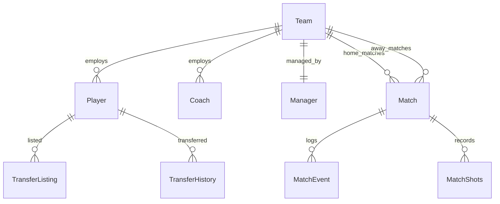

# 03. Data Models & Schemas

This document defines the database schemas (SQLAlchemy / SQLite), domain classes, trajectory binary schemas, and API request/response contracts (Pydantic v2).

---

## 1. Database Schema (`backend/src/database/models.py`)

Persistent match and season data is stored in SQLite (`football_sim.db`) and managed with **SQLAlchemy ORM** and **Alembic**.



### Core Table Definitions

#### `Team`
* `team_id` (PK, Integer): Unique identifier.
* `name` (String, Unique): Club name (e.g. "Arsenal", "Manchester City").
* `manager_id` (FK $\rightarrow$ `Manager.manager_id`, Nullable): Current head coach.
* `transfer_budget` (Float): Available transfer funds in GBP.
* `wage_budget` (Float): Weekly wage allowance in GBP.
* `stadium_capacity` (Integer): Matchday seat capacity.

#### `Player`
* `player_id` (PK, Integer): Unique identifier.
* `name` (String): Full name.
* `age` (Integer): Current age (16–40).
* `position` (String): Primary tactical role ("GK", "CB", "LB", "RB", "CM", "CAM", "LW", "RW", "ST").
* `team_id` (FK $\rightarrow$ `Team.team_id`, Nullable): Associated club.
* `potential` (Integer, 1–100): Ceiling rating.
* `wage` (Float): Weekly salary in GBP.
* `contract_length` (Integer): Remaining years on contract.
* `squad_role` (String): "KEY", "FIRST_TEAM", "ROTATION", "YOUTH".

#### `Manager`
* `manager_id` (PK, Integer): Unique identifier.
* `name` (String): Manager name.
* `formation` (String): Preferred layout ("4-3-3", "4-2-3-1", "3-5-2", "5-3-2").
* `style` (String): Tactical philosophy ("Gegenpress", "Tiki-Taka", "Counter", "Direct").

#### `Match`
* `match_id` (PK, Integer): Unique fixture ID.
* `match_number` (Integer): Matchday fixture number (1–380).
* `season_year` (Integer): Calendar season.
* `date` (String): Scheduled match timestamp.
* `home_team_id` (FK $\rightarrow$ `Team.team_id`), `away_team_id` (FK $\rightarrow$ `Team.team_id`).
* `home_goals` (Integer), `away_goals` (Integer).
* `home_possession` (Float), `away_possession` (Float).
* `weather` (String): "Sunny", "Rain", "Snow", "Windy".
* `intensity` (String): Match tempo rating (1–100).
* `trace_file` (String, Nullable): Path to recorded `MatchTrajectory` artifact (`.npz` or `.dump`).

#### `MatchEvent`
* `event_id` (PK, Integer): Unique event index.
* `match_id` (FK $\rightarrow$ `Match.match_id`): Fixture reference.
* `minute` (Integer): Match minute (0–90+).
* `type` (String): "goal", "yellow_card", "red_card", "injury", "substitution", "home_lineup", "away_lineup".
* `player` (String): Involved player name or formation identifier.
* `team` (String): "home", "away", or "both".
* `details` (String): JSON encoded metadata or descriptive commentary.

---

## 2. Footy $\to$ GRF Domain Adapter (`GRFPlayerProfile`)

Translates high-level Footy attributes into physical simulation multipliers:

```python
@dataclass
class GRFPlayerProfile:
    player_id: int
    name: str
    position: str
    speed_multiplier: float        # 0.85 to 1.15
    acceleration_multiplier: float # 0.90 to 1.10
    shot_power_multiplier: float   # 0.80 to 1.20
    pass_accuracy_bias: float      # -0.15 to +0.15
    tackle_success_rate: float     # 0.50 to 0.90
    stamina_depletion_rate: float  # 0.80 to 1.20
```

---

## 3. Match Trajectory Binary Schema (`.npz`)

The central immutable artifact generated during simulation and consumed during replay rendering:

```python
@dataclass
class MatchTrajectory:
    # 1. Identification & Versioning
    match_id: str
    season_year: int
    seed: int
    fingerprint: str              # SHA256 of metadata + actions
    
    # 2. Time & Spatial Arrays (Compressed uint16 / float16)
    ticks: np.ndarray             # (T,) uint16
    player_positions: np.ndarray  # (T, 22, 2) float16
    player_directions: np.ndarray # (T, 22, 2) float16
    ball_position: np.ndarray     # (T, 3) float16
    ball_velocity: np.ndarray     # (T, 3) float16
    
    # 3. Discrete Actions & Ownership
    actions: np.ndarray           # (T, 20) uint8
    ball_owner_team: np.ndarray   # (T,) int8 (-1, 0, 1)
    ball_owner_player: np.ndarray # (T,) int8 (0..10)
    score_timeline: np.ndarray    # (T, 2) uint8
    
    # 4. Opta Event List
    events: List[Dict[str, Any]]
```

---

## 4. Simulation Fingerprint

Ensures mathematical reproducibility across software revisions:

```json
{
  "engine": "GRF",
  "engine_version": "2.1.0",
  "grf_version": "1.1.0",
  "tikick_checkpoint_sha256": "4f9b87c12d4a5b6e...",
  "feature_schema": "268-v3-canonical",
  "seed": 84592,
  "home_formation": "4-3-3",
  "away_formation": "4-2-3-1",
  "ruleset": "premier_league_2026",
  "trajectory_sha256": "e3b0c44298fc1c14..."
}
```

---

## 5. API Request & Response Schemas (Pydantic v2)

### `GRFSimulationRequest`
```python
class GRFSimulationRequest(BaseModel):
    match_id: Optional[str] = None
    home_team_name: str = "Arsenal"
    away_team_name: str = "Chelsea"
    home_formation: str = "4-3-3"
    away_formation: str = "4-2-3-1"
    generate_video: bool = False
    max_steps: int = Field(default=1200, ge=1, le=5000)
    seed: Optional[int] = None
```

### `MatchSimulationResponse`
```python
class MatchSimulationResponse(BaseModel):
    match_id: str
    home_team: str
    away_team: str
    home_score: int
    away_score: int
    possession: Dict[str, float]       # {"home": 53.0, "away": 47.0}
    shots: Dict[str, int]              # {"home": 8, "away": 5}
    xg: Dict[str, float]               # {"home": 1.42, "away": 0.88}
    events: List[Dict[str, Any]]
    video_url: Optional[str] = None
    trajectory_url: Optional[str] = None
    fingerprint: Optional[str] = None
```
