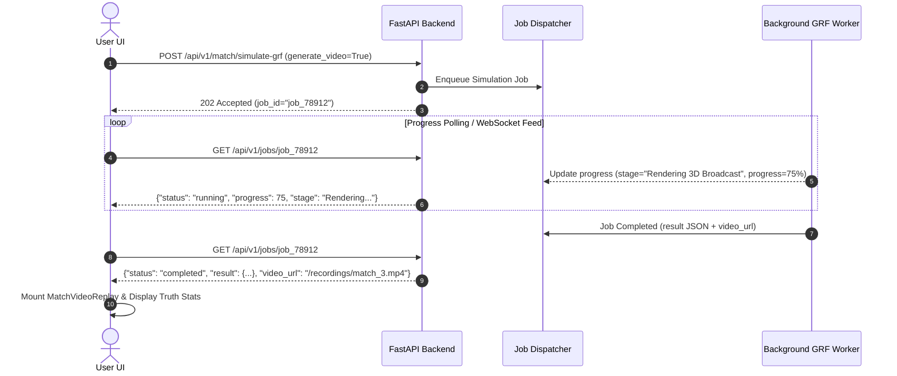

# 04. Frontend Guide & UI Architecture

This document details the architecture, component hierarchy, state management, and visualization layers of the React frontend (`frontend/`).

---

## 1. Tech Stack & Libraries

* **Framework**: React 18 (Vite + TypeScript)
* **Styling**: Tailwind CSS 3.4 + Material UI (MUI v5)
* **Icons**: Material Icons + Lucide React
* **Charts & Visualizations**: Recharts (financial metrics, progression curves, radar pentagons)
* **State Management**: Zustand stores + React Query (TanStack Query v5)
* **HTTP & Sockets**: Axios API client + native WebSocket client

---

## 2. Directory Structure

```
frontend/src/
├── components/
│   ├── FormationViewer.tsx         # Interactive 2D tactical formation canvas
│   ├── MatchVideoReplay.tsx        # Video player for broadcast highlight reels & multi-cam
│   ├── StandingsTable.tsx          # Real-time league table with form chips
│   ├── SeasonComparisonCharts.tsx  # Multi-season performance graph
│   ├── FinancialChart.tsx          # Club revenue vs. wage expenditures
│   ├── HeaderNotificationsDrawer.tsx
│   ├── HeaderBookmarksMenu.tsx
│   └── HeaderSettingsModal.tsx
├── pages/
│   ├── Dashboard.tsx               # Command center, live sim controls, standings
│   ├── LeagueOverview.tsx          # Complete league table & form analysis
│   ├── MatchDetail.tsx             # Deep match analysis with xG timeline & video
│   ├── MatchReports.tsx            # Historical fixture results & event logs
│   ├── ManagerProfiles.tsx         # AI Manager brain overview & win rates
│   ├── ManagerDetail.tsx           # Individual manager tactical setup & Q-learning state
│   ├── PlayerProfiles.tsx          # League-wide player scouting directory
│   ├── PlayerDetail.tsx            # Attribute pentagon, contract, & valuation breakdown
│   ├── TransferMarket.tsx          # Transfer window activity & top signings
│   ├── YouthAcademy.tsx            # U21 academy talents & coaching pipelines
│   ├── MlBenchmarks.tsx            # DQN vs Heuristic/Rule-Based policy charts
│   ├── StatisticsAnalytics.tsx     # League statistical distributions & xG leaders
│   └── SeasonReports.tsx           # Multi-season historical archive
├── services/
│   └── api.ts                      # Centralized typed API service layer
├── store/                          # Zustand global state slices
├── App.tsx                         # Client-side routing & master layout
└── main.tsx                        # React application bootstrap
```

---

## 3. Core Pages & Visualization Features

### 1. Premier League Command Center (`Dashboard.tsx`)
* Live season standings with UEFA Champions League / Europa League qualification markers.
* Instant simulation trigger buttons with real-time WebSocket progress bars.
* Multi-season history selector.

### 2. Tactical Formation Viewer (`FormationViewer.tsx`)
* Interactive 2D football pitch mapping real $(x, y)$ coordinates.
* Visualizes player positions, tactical width, pressing line depth, and role tags (GK, CB, CDM, CAM, ST).
* Supports instant formation toggling (`4-3-3`, `4-2-3-1`, `3-5-2`, `4-4-2`, `5-3-2`).

### 3. Broadcast Replay Player (`MatchVideoReplay.tsx`)
* Streams pre-rendered broadcast highlight videos or interactive keyframes directly from `MatchTrajectory` artifacts.
* Features Premier League / UCL style floating HUD scoreboards, goal celebration banners, and studio halftime analytics.
* Instant replay toggle for key match events with slow-motion playback.

### 4. Player Attribute Radar (`PlayerDetail.tsx`)
* FM-style 5-axis pentagon radar chart comparing:
  - **Technical**: Shooting, Passing, Dribbling, Tackling.
  - **Mental**: Vision, Composure, Positioning.
  - **Physical**: Pace, Stamina, Strength.
  - **Goalkeeping**: Handling, Reflexes (for GKs).
* Real-time market valuation calculator and wage breakdown.

### 5. AI Manager & ML Benchmarks (`MlBenchmarks.tsx`, `ManagerDetail.tsx`)
* Compares trained PyTorch DQN manager checkpoints against static and heuristic policies.
* Displays win rate percentages, average league finish, cumulative rewards, and tactical style breakdowns.

---

## 4. Asynchronous Job & Simulation Execution Flow

Simulations and video renderings run asynchronously without blocking the user interface:



---

## 5. API Client Integration (`services/api.ts`)

The frontend interacts with the FastAPI backend through typed endpoints:

| Endpoint | Method | Purpose |
| :--- | :--- | :--- |
| `/api/v1/seasons` | `GET` | Fetch list of available seasons |
| `/api/v1/seasons/{year}` | `GET` | Get full season report snapshot |
| `/api/v1/standings` | `GET` | Get current live league table |
| `/api/v1/teams/{id}` | `GET` | Get squad roster, finances, and manager info |
| `/api/v1/players/{id}` | `GET` | Get player attributes, contract, and form ratings |
| `/api/v1/match/{id}` | `GET` | Get match statistics, $xG$ timeline, and events |
| `/api/v1/match/{id}/video` | `GET` | Get video highlight stream URI |
| `/api/v1/match/{id}/render-status` | `GET` | Check background video rendering progress |
| `/api/v1/match/simulate-grf` | `POST` | Trigger authentic GRF simulation & trajectory creation |
| `/api/v1/run-simulation` | `POST` | Trigger multi-season league simulation |
| `/api/v1/ml/benchmarks` | `GET` | Retrieve DQN evaluation benchmark reports |
