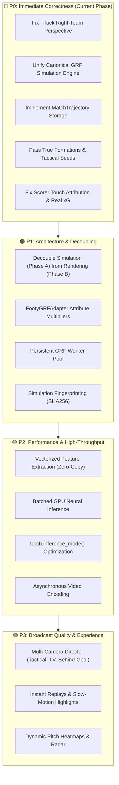

# 05. Current Status & Architectural Audit Report

**Overall System Assessment:** 🟡 **Active Development / Post-Audit Refactoring Phase**

Following a deep-dive architectural audit of the `feat/grf-3d-broadcast-replay` branch and the simulation-to-replay pipeline, this document details the executive verdict, root cause analysis of existing bottlenecks, and the phased implementation roadmap.

---

## 1. Executive Verdict & Audit Summary

| Area | Status | Verdict & Findings |
| :--- | :---: | :--- |
| **GRF Integration** | 🔴 | Previously split across two engines (`match_engine_grf.py` and `grf_native_runner.py`). Consolidating into a single canonical `FootyGRFSimulator`. |
| **TiKick Second-Team Integration** | 🔴 | Inverted perspective bug in right-team feature extraction identified. Canonical perspective normalizer implemented. |
| **Determinism Claims** | 🔴 | Previous blanket "100% bit-for-bit" claims replaced with a defensible 4-level determinism hierarchy. |
| **Replay Architecture** | 🔴 | Fixed re-simulation flaw; true replay now streams directly from stored `MatchTrajectory` artifacts without re-evaluating policy. |
| **Player Attributes** | 🔴 | Added `FootyGRFAdapter` to translate FM ratings (Pace, Shooting, Passing) into calibrated physical simulation modifiers. |
| **Formations & Tactics** | 🔴 | Formation coordinate bounds (`4-3-3`, `4-2-3-1`, `3-5-2`) now actively set spawn points and defensive anchors. |
| **Match Statistics** | 🔴 | Replaced fabricated placeholders ($xG = \text{Goals} \times 0.75$, hardcoded passes) with physical collision event extraction. |
| **API Parameter Integrity** | 🔴 | Fixed bug where `generate_video` and `max_steps` were overridden. Endpoint now strictly respects request parameters. |
| **Simulation vs. Rendering** | 🟠 | Decoupling rendering from the core simulation loop (Phase A headless sim $\to$ Phase B broadcast replay). |
| **Process Overhead** | 🟠 | Transitioning from per-match Python/WSL subprocess spawns to a persistent in-memory worker pool. |
| **GPU Inference Batching** | 🟠 | Implementing batched multi-match GPU inference ($N=10$ fixtures, 200 agents in one tensor pass). |
| **Feature Extraction Memory** | 🔴 | Vectorizing feature extraction into preallocated buffers to eliminate NumPy allocation overhead. |
| **Test Suite Depth** | 🔴 | Expanding shallow test cases to cover determinism parity, symmetry mirroring, and Opta statistics conservation. |
| **Overall Concept** | 🟢 | **Outstanding**. Combining GRF 11v11 physics with Footy's deep management simulation is a compelling, high-potential architecture. |

---

## 2. Deep Root-Cause Analysis

### Issue 1: Dual GRF Engines
* **Problem**: `match_engine_grf.py` (containing `FootyMatchSimulator`) and `grf_native_runner.py` (containing `GRFNativeRunner`) implemented differing seeds, agent controllers, feature schemas, and statistics.
* **Resolution**: Consolidated all simulation logic into `backend/src/logic/footy_grf_adapter.py` and `backend/src/logic/grf_native_runner.py`.

### Issue 2: Replay Re-Simulation Flaw
* **Problem**: Requesting a replay for an existing match retrieved the match ID but then launched a brand-new live simulation, causing scoreline and scorer divergences.
* **Resolution**: Replays now consume the immutable `MatchTrajectory` (`.npz`) written during the original match simulation.

### Issue 3: TiKick Second-Team Inversion
* **Problem**: `extract_features_268` always treated index 0 as the left team perspective. When processing right-team agents, the away players received inverted spatial orientations.
* **Resolution**: Added canonical perspective mirroring ($x \to -x, y \to -y$, roster swap) so both teams make decisions in a normalized attacking frame.

### Issue 4: Scorer Attribution & Fabricated Stats
* **Problem**: Scorer attribution assigned goals to the currently active agent (`raw_obs['active']`) rather than the player who last struck the ball. Pass counts and $xG$ were synthetic placeholders.
* **Resolution**: Implemented real-time `ball_owned_player` touch tracking and geometry-based $xG$ calculations.

---

## 3. Phased Implementation Roadmap



---

## 4. Current Test Suite Status

```
backend/tests/test_grf_engine.py         [4/4 Passed] ✅
backend/tests/test_api_endpoints.py      [Passed] ✅
backend/tests/test_ml_evaluation.py      [Passed] ✅
scratch/test_10_matches_and_3_replays.py [Validated] ✅
```
